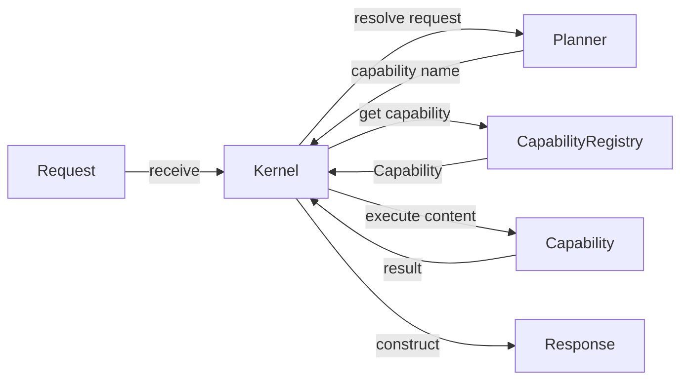
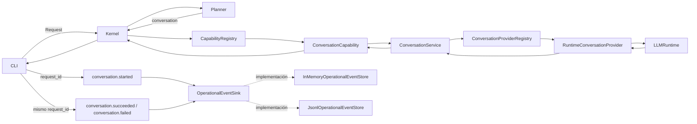

# Mapa de componentes actuales

<!-- MALAK_VAULT_SYNC:START -->
## Proyección automática de sincronización

> [!warning] Estado derivado pendiente de revisión
> Este bloque fue generado de forma determinista a partir de
> `Aranwill/jarvis/main`. No aprueba decisiones, no cierra
> sprints y no reemplaza la revisión humana del documento.

- **Run ID:** `20260904T012307383033Z_5cbdd35a_372955f9`
- **HEAD oficial observado:** `5cbdd35aa86a8cc4131b787e8d7259325949b561`
- **Commit previamente observado:** `2864435401353e5abcfcb51fc276361a0225c2b7`
- **Generado:** `2026-09-04T01:23:07.383033+00:00`
- **Prioridad:** `high`
- **Disposición:** `review_required`

### Estado estructurado de la fuente oficial

- **Ficha de sprint más reciente:** `docs/project/sprints/SPRINT-7.9.md`
- **Título declarado:** Sprint 7.9 — Conversation Continuity Foundation
- **Estado declarado:** `completado`
- **`as_of_commit` declarado:** `d58b8ec98d48f5e2eac115d1d54b193e1df617fd`

### Commits oficiales observados

- 5cbdd35aa86a8cc4131b787e8d7259325949b561	Merge pull request #56 from Aranwill/sprint/7.9-conversation-continuity
- 0d3c630a91a21ba2eb9778e91baeaade5da79e95	docs(sprint): close Sprint 7.9
- fd7ae9782dbb14921cff8b9f56dba6aa961cf1c7	docs(project): reconcile Sprint 7.9 validated state
- 58449307d549afc60196570a9f19337f38ac18cd	docs(sprint): record Sprint 7.9 validation evidence
- d58b8ec98d48f5e2eac115d1d54b193e1df617fd	fix(cli): document new conversation command
- 3ed0d09af5e4a64ba87742116c6c2ff4b0333cf6	fix(conversation): enforce supported history roles
- 071e2a6270b3e34bc4828396f2924b842efc7d5b	feat(cli): add ephemeral conversation continuity
- eb3df70cf90ccb84e5cf3b579507722b2f578544	feat(runtime): adapt Ollama runtime to structured chat
- 9a436bc25285889052e8c1f56fdaa2bbf75545ab	feat(conversation): integrate bounded context into conversation service
- a8155fd63f08a47d942fb276962349281ea224af	feat(conversation): add bounded in-memory conversation context
- 67ede24e263e92bde9f24c8300494bda9c4fd328	feat(conversation): extend conversation contract with history
- 796bff36290e6673e51e53e9ac332b48151d883a	docs(project): activate Sprint 7.9 conversation continuity

### Evidencia que originó esta proyección

- `architecture-change` por `src/malak/app/cli.py`
- `architecture-change` por `src/malak/core/conversation.py`
- `architecture-change` por `src/malak/runtime/ollama_runtime.py`
- `architecture-change` por `src/malak/services/conversation_context.py`
- `architecture-change` por `src/malak/services/conversation_service.py`
- `baseline-source-change` por `docs/project/implementation_roadmap.md`
- `baseline-source-change` por `docs/project/project_context.md`
- `baseline-source-change` por `docs/project/sprints/SPRINT-7.9.md`
<!-- MALAK_VAULT_SYNC:END -->

<!-- MALAK_OPERATIONAL_STATE:START -->
## Estado operativo derivado

> Estado machine-owned derivado de la fuente oficial.
> No concede autoridad ni reemplaza decisiones humanas.

- **HEAD oficial:** `5cbdd35aa86a8cc4131b787e8d7259325949b561`
- **Ficha de sprint vigente:** `docs/project/sprints/SPRINT-7.9.md`
- **Titulo declarado:** Sprint 7.9 — Conversation Continuity Foundation
- **Estado declarado:** `completado`
- **`as_of_commit` declarado:** `d58b8ec98d48f5e2eac115d1d54b193e1df617fd`
<!-- MALAK_OPERATIONAL_STATE:END -->

> [!warning] Naturaleza derivada
> Este documento representa únicamente relaciones verificadas en el repositorio oficial para el baseline indicado.
>
> No redefine la arquitectura, no documenta capacidades futuras y no posee autoridad operativa.

## 1. Alcance

Este mapa cubre las siguientes fronteras verificadas:

- `Request`;
- `Kernel`;
- `Planner`;
- `CapabilityRegistry`;
- `EchoCapability`;
- `ConversationCapability`;
- `ConversationService` y `ConversationProviderRegistry`;
- `RuntimeConversationProvider` y `LLMRuntime`;
- `Response`;
- CLI conversacional integrada mediante `Kernel.receive`;
- eventos operativos;
- stores operativos.
- contratos fundamentales de autorización.
- Policy Decision Point mínimo.
- Policy Enforcement Point inicial.

Quedan fuera de alcance:

- detalle interno de proveedores y runtimes;
- métricas de runtime;
- auditoría de seguridad;
- auditoría de autorización;
- componentes propuestos en el roadmap.

Su exclusión de este documento no implica que no existan. Solamente evita mezclar subsistemas todavía no verificados dentro de este mapa.

Sprint 7.4 incorporó eventos operativos y correlación desde la CLI sin
modificar el flujo Kernel–Planner–Capability.

Sprint 7.8 integró la ruta conversacional dentro del pipeline
Kernel–Planner–Capability mediante `ConversationCapability`. La integración es
indirecta: el Kernel no depende directamente de `ConversationService`, providers
ni runtimes concretos.

## 2. Referencia operativa del mapa

Este mapa deriva del repositorio oficial:

- **Repositorio:** `Aranwill/jarvis`
- **Rama:** `main`

El HEAD oficial, el sprint estructurado vigente y los demás datos operativos
que puedan derivarse de forma determinista pertenecen exclusivamente al bloque
`MALAK_OPERATIONAL_STATE`.

El cuerpo humano de este documento describe componentes, responsabilidades y
relaciones verificadas. No mantiene manualmente una copia del baseline
operativo vigente.

Las referencias a sprints que aparecen en las secciones de componentes se
conservan únicamente como provenance histórica de su incorporación.
## 3. Componentes verificados

### `Request`

Contrato de entrada recibido por el Kernel.

Fuente:

```text
src/malak/core/request.py
```

### `Kernel`

Punto de entrada del flujo gobernado mínimo.

Responsabilidades verificadas:

- crear el Planner;
- crear el Capability Registry;
- validar solicitudes vacías;
- solicitar al Planner una capability;
- recuperar la capability desde el registro;
- ejecutar la capability;
- construir la respuesta.

Fuente:

```text
src/malak/kernel/kernel.py
```

### `Planner`

Selector determinista de capability.

Comportamiento actual:

El Planner devuelve de forma determinista el nombre de capability configurado.
Su valor predeterminado continúa siendo `"echo"`, mientras que la composición
conversacional lo configura explícitamente con `"conversation"`.

Fuente:

```text
src/malak/services/planner.py
```

### `CapabilityRegistry`

Registro en memoria de capabilities disponibles.

Responsabilidades verificadas:

- registrar capabilities;
- impedir nombres duplicados;
- recuperar una capability por nombre;
- listar capabilities registradas;
- normalizar nombres a minúsculas.

Fuente:

```text
src/malak/kernel/registry.py
```

### `EchoCapability`

Capability disponible para el bootstrap mínimo basado en `echo`.

Fuente:

```text
src/malak/capabilities/echo.py
```

### `ConversationCapability`

Capability que adapta el contrato genérico de ejecución hacia
`ConversationService`.

La composición conversacional registra esta capability en un
`CapabilityRegistry` y configura el Planner con su nombre (`"conversation"`).

Fuentes:

```text
src/malak/capabilities/conversation.py
src/malak/app/composition.py
```

### `Response`

Contrato de salida construido por el Kernel.

Fuente:

```text
src/malak/core/response.py
```

### `OperationalEvent`

Contrato inmutable con allowlist de:

```text
event_name
component
occurred_at
outcome
request_id
reason_code
```

Fuente:

```text
src/malak/observability/operational_event.py
```

### `OperationalEventSink`

Contrato estructural de solo escritura:

```python
append(event: OperationalEvent) -> None
```

Fuente:

```text
src/malak/observability/operational_event_sink.py
```

### Stores operativos

Implementaciones verificadas:

```text
InMemoryOperationalEventStore
JsonlOperationalEventStore
```

Los stores permanecen separados de los stores de métricas.

Fuentes:

```text
src/malak/observability/operational_event_store.py
src/malak/observability/operational_event_jsonl_store.py
```

### Integración CLI

La CLI genera exclusivamente el `request_id` para cada intento
conversacional válido y emite:

```text
conversation.started
conversation.succeeded
conversation.failed
```

La dependencia del sink es opcional. `main()` no crea automáticamente
un store JSONL y no existe persistencia implícita.

Fuente:

```text
src/malak/app/cli.py
```

### Contratos fundamentales de autorización

El Sprint 7.5 incorporó cuatro contratos inmutables y desacoplados:

| Contrato | Responsabilidad verificada |
| --- | --- |
| `PermissionScope` | Identificar un recurso y una acción normalizados |
| `SecurityContext` | Identificar al sujeto y su estado de autenticación |
| `AuthorizationRequest` | Relacionar contexto, permiso, identificador y fecha trazable |
| `AuthorizationDecision` | Expresar un resultado binario y su razón |

Estos contratos:

- están expuestos mediante `malak.security`;
- separan solicitud y decisión;
- no ejecutan operaciones;
- no implementan políticas;
- no dependen de LLM;
- no modifican el Kernel, Planner ni runtimes.

Fuentes:

```text
src/malak/security/contracts.py
src/malak/security/__init__.py
tests/test_authorization_contracts.py
```

### Policy Decision Point mínimo

El Incremento 3 incorporó un punto de decisión determinista y
desacoplado:

| Componente | Responsabilidad verificada |
| --- | --- |
| `PolicyDecisionPoint` | Definir el contrato estructural de decisión |
| `StaticPolicyDecisionPoint` | Evaluar reglas exactas con denegación por defecto |
| `PolicyRule` | Relacionar sujeto, permiso y efecto explícitos |
| `PolicyEffect` | Representar `ALLOW`, `DENY` y `REQUIRE_HUMAN_CONFIRMATION` dentro del PDP |
| `HumanConfirmationEvidence` | Ligar de forma inmutable la confirmación a la solicitud original y a la nueva |
| `HumanConfirmationVerifier` | Separar la verificación de evidencia de la decisión |

La salida pública continúa siendo `AuthorizationDecision` binaria.
El PDP no admite comodines, herencia implícita, interpretación de texto
ni participación de LLM. La ausencia de regla, un sujeto no autenticado,
evidencia incongruente o un fallo del verificador producen denegación
segura.

El PDP no ejecuta operaciones. El enforcement permanece separado en el
PEP inicial descrito a continuación.

Fuentes:

```text
src/malak/security/pdp.py
src/malak/security/__init__.py
tests/test_policy_decision_point.py
docs/project/sprints/SPRINT-7.5.md
```

### Policy Enforcement Point inicial

El Incremento 4 incorporó una frontera de enforcement determinista y
fail-closed:

| Componente | Responsabilidad verificada |
| --- | --- |
| `PolicyEnforcementPoint` | Definir el contrato estructural de enforcement |
| `StrictPolicyEnforcementPoint` | Consultar al PDP inyectado, validar la decisión y controlar la ejecución |
| `ProtectedOperation` | Representar una operación protegida sin acoplarla al PEP |
| `AuthorizationDeniedError` | Diferenciar una denegación válida del PDP |
| `AuthorizationEnforcementError` | Bloquear fallos, tipos inválidos o decisiones incongruentes |

El PEP no acepta decisiones aportadas por el llamador. Consulta
directamente al PDP, verifica que la decisión corresponda al
`request_id` original y ejecuta la operación exactamente una vez solo
ante una autorización válida. Los fallos del PDP bloquean la operación;
los fallos de la operación se propagan sin reintento automático.

El incremento no conecta operaciones reales, no integra el PEP con
Kernel, Planner, CLI o runtimes y no incorpora todavía evidencia de
auditoría de autorización.

Fuentes:

```text
src/malak/security/pep.py
src/malak/security/__init__.py
tests/test_policy_enforcement_point.py
docs/architecture/adr/ADR-002-policy-enforcement-boundary.md
docs/project/sprints/SPRINT-7.5.md
```

## 4. Flujo implementado

El Kernel mantiene un flujo genérico Kernel–Planner–Capability. La capability
concreta depende de la composición utilizada.



## 5. Flujo operativo conversacional



La CLI enruta las solicitudes conversacionales válidas mediante
`Kernel.receive()`. `ConversationCapability` mantiene al Kernel desacoplado de
`ConversationService`, providers y runtimes concretos.

La observabilidad no posee semántica de autorización ni de auditoría
de seguridad.

## 6. Secuencia funcional

1. La CLI construye un `Request` para una entrada conversacional válida.
2. La CLI entrega el `Request` a `Kernel.receive`.
3. El Kernel rechaza contenido vacío y solicita al Planner el nombre de capability.
4. En la composición conversacional, el Planner devuelve `"conversation"`.
5. El Kernel consulta el `CapabilityRegistry`.
6. El registro devuelve `ConversationCapability`.
7. El Kernel ejecuta la capability con el contenido de la solicitud.
8. `ConversationCapability` delega en `ConversationService`.
9. `ConversationService` resuelve el provider mediante `ConversationProviderRegistry`.
10. `RuntimeConversationProvider` delega la generación en `LLMRuntime`.
11. El resultado vuelve por la misma frontera hasta el Kernel.
12. El Kernel construye un `Response` y la CLI presenta su contenido.

## 7. Bootstrap y composición verificados

El bootstrap mínimo basado en `echo` permanece disponible mediante:

```text
src/malak/kernel/bootstrap.py
```

Ese helper:

1. crea una instancia de `CapabilityRegistry`;
2. crea y registra `EchoCapability`;
3. devuelve el registro inicializado.

La ruta conversacional utiliza una composición distinta:

```text
src/malak/app/composition.py
```

`build_conversation_kernel()`:

1. crea `ConversationCapability`;
2. la registra en un `CapabilityRegistry`;
3. configura `Planner` con el nombre `"conversation"`;
4. construye el Kernel con ese Planner y ese registro.

## 8. Límites de la representación

Este mapa no afirma:

- que el Planner utilice un LLM;
- que exista planificación dinámica;
- que el Kernel invoque directamente un runtime LLM;

- que existan múltiples capabilities activas;
- que el registro sea persistente;
- que el diagrama represente toda la arquitectura de Malāk.
- que eventos operativos y métricas compartan contratos o stores;
- que exista auditoría de autorización;
- que la observabilidad adopte decisiones de autorización;
- que `ConversationRequest` contenga `request_id`.
- que los contratos de autorización concedan permisos por sí mismos.

## 9. Hallazgos arquitectónicos descriptivos

Sin convertirlos en decisiones nuevas, el código observado muestra:

- selección de capability separada de su ejecución;
- resolución determinista en el Planner actual;
- registro desacoplado mediante el contrato `Capability`;
- bootstrap explícito de capabilities;
- respuesta final construida por el Kernel;
- tratamiento explícito de solicitudes vacías y capabilities inexistentes.
- generación exclusiva de `request_id` en la CLI;
- contratos operativos separados de las métricas;
- persistencia operativa opcional e inyectada;
- degradación controlada ante fallos del sink;
- Kernel, Planner y contratos conversacionales intactos.
- solicitud, contexto, permiso y decisión representados por contratos
  separados e inmutables;
- PDP determinista separado de la ejecución;
- reglas exactas y denegación por defecto;
- evidencia de confirmación inmutable y verificador inyectable;
- PEP separado del PDP y de la operación protegida;
- enforcement fail-closed con asociación estricta por `request_id`;
- ausencia de integración con operaciones reales y de auditoría de
  autorización.

## 10. Fuentes oficiales

- `src/malak/kernel/kernel.py`
- `src/malak/kernel/bootstrap.py`
- `src/malak/kernel/registry.py`
- `src/malak/services/planner.py`
- `src/malak/contracts/capability.py`
- `src/malak/capabilities/echo.py`
- `src/malak/capabilities/conversation.py`
- `src/malak/app/composition.py`
- `src/malak/services/conversation_service.py`
- `src/malak/core/conversation_registry.py`
- `src/malak/providers/runtime_provider.py`
- `src/malak/core/llm_runtime.py`
- `src/malak/core/request.py`
- `src/malak/core/response.py`
- `src/malak/app/cli.py`
- `src/malak/observability/operational_event.py`
- `src/malak/observability/operational_event_sink.py`
- `src/malak/observability/operational_event_store.py`
- `src/malak/observability/operational_event_jsonl_store.py`
- `src/malak/security/contracts.py`
- `src/malak/security/pdp.py`
- `src/malak/security/pep.py`
- `src/malak/security/__init__.py`
- `tests/test_authorization_contracts.py`
- `tests/test_policy_decision_point.py`
- `tests/test_policy_enforcement_point.py`
- `docs/architecture/adr/ADR-002-policy-enforcement-boundary.md`
- `docs/project/sprints/SPRINT-7.4.md`
- `docs/project/sprints/SPRINT-7.5.md`

## 11. Navegación relacionada

- [[01-architecture/ARCHITECTURE_INDEX|Índice de arquitectura]]
- [[02-current-baseline/CURRENT_BASELINE|Baseline vigente]]
- [[08-session-context/MALAK_SESSION_CONTEXT|Contexto de sesión]]
- [[09-repository-snapshots/SNAPSHOT_INDEX|Índice de snapshots]]
- [[10-knowledge-index/KNOWLEDGE_INDEX|Índice maestro]]

## 12. Próximos mapas posibles

Los siguientes mapas permanecen pendientes y no están aprobados automáticamente:

- mapa detallado del subsistema conversacional;
- mapa detallado de métricas y eventos operativos;
- mapa de contratos actuales;
- mapa de límites del Kernel.

Cada uno deberá verificarse separadamente contra el repositorio oficial.
