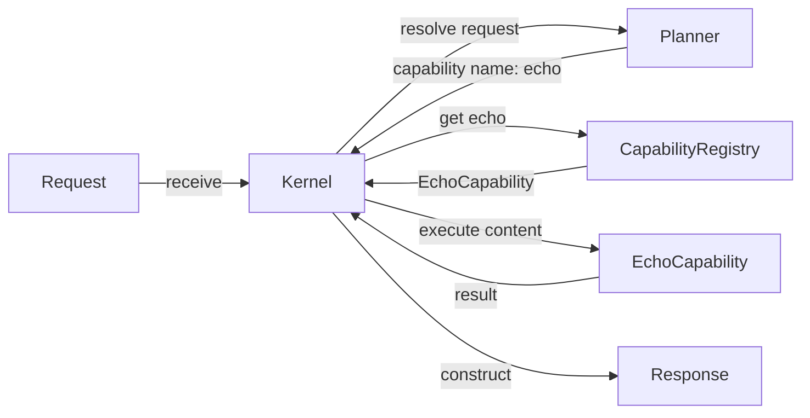
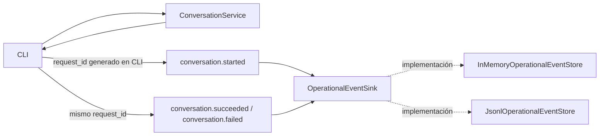

# Mapa de componentes actuales

<!-- MALAK_VAULT_SYNC:START -->
## Proyección automática de sincronización

> [!warning] Estado derivado pendiente de revisión
> Este bloque fue generado de forma determinista a partir de
> `Aranwill/jarvis/main`. No aprueba decisiones, no cierra
> sprints y no reemplaza la revisión humana del documento.

- **Run ID:** `20260726T191148713343Z_4afeed44_b20482cf`
- **HEAD oficial observado:** `4afeed440a3bf2096035d0d458d2ef75c71689fd`
- **Commit previamente observado:** `7cd7fcc811df01555837319ec4cac0a93ef94fff`
- **Generado:** `2026-07-26T19:11:48.713343+00:00`
- **Prioridad:** `high`
- **Disposición:** `review_required`

### Estado estructurado de la fuente oficial

- **Ficha de sprint más reciente:** `docs/project/sprints/SPRINT-7.5.md`
- **Título declarado:** Sprint 7.5 — Base del plano de control de seguridad
- **Estado declarado:** `en progreso`
- **`as_of_commit` declarado:** `c0a4283b100609daeb4b3422dd28634df9d851b6`

### Commits oficiales observados

- 4afeed440a3bf2096035d0d458d2ef75c71689fd	Merge pull request #16 from Aranwill/docs/sprint-7.5-activation-reconciliation
- 0bcdbcb13efd4c3087e82b91d259e77c938d3aea	fix(docs): repair roadmap encoding
- f8cf65945fde070f9c81efd28e4b5305dae39386	docs(project): reconcile sprint 7.5 activation
- c0a4283b100609daeb4b3422dd28634df9d851b6	Merge pull request #15 from Aranwill/feature/sprint-7.5-authorization-contracts
- 841e4814c620fd7b98188e29931ec4600bfaec13	feat(security): add authorization contracts

### Evidencia que originó esta proyección

- `architecture-change` por `src/malak/security/__init__.py`
- `architecture-change` por `src/malak/security/contracts.py`
<!-- MALAK_VAULT_SYNC:END -->

> [!warning] Naturaleza derivada
> Este documento representa únicamente relaciones verificadas en el repositorio oficial para el baseline indicado.
>
> No redefine la arquitectura, no documenta capacidades futuras y no posee autoridad operativa.

## 1. Alcance

Este mapa cubre dos fronteras verificadas:

- `Request`;
- `Kernel`;
- `Planner`;
- `CapabilityRegistry`;
- `EchoCapability`;
- `Response`;
- CLI conversacional;
- eventos operativos;
- stores operativos.

Quedan fuera de alcance:

- integración formal entre Kernel y subsistema conversacional;
- detalle interno de proveedores y runtimes;
- métricas de runtime;
- auditoría de seguridad;
- seguridad futura;
- componentes propuestos en el roadmap.

Su exclusión de este documento no implica que no existan. Solamente evita mezclar subsistemas todavía no verificados dentro de este mapa.

Sprint 7.4 incorporó eventos operativos y correlación desde la CLI sin
modificar el flujo Kernel–Planner–Capability.

No existe integración formal entre `Kernel.receive` y `ConversationService`, y este mapa no propone ni autoriza dicha integración.

## 2. Baseline representado

- **Repositorio:** `Aranwill/jarvis`
- **Rama:** `main`
- **Commit:** `7cd7fcc811df01555837319ec4cac0a93ef94fff`
- **Versión nominal:** `v0.6.0-alpha`
- **Último sprint formalmente cerrado:** Sprint 7.3 — Conversation Provider Boundary Stabilization
- **Sprint integrado en progreso:** Sprint 7.4 — Consolidación de logs, métricas y auditoría
- **Pull request integrado:** PR #14
- **Suite integral documentada:** 121 pruebas aprobadas sobre `5b951918006c464745e1eb1e3816bde619fad8b1`
- **Incremento 8:** en ejecución documental gobernada

## 3. Componentes verificados

### `Request`

Contrato de entrada recibido por el Kernel.

Fuente:

```text
src/malak/core/request.py
```

### `Kernel`

Punto de entrada del flujo gobernado mínimo.

Responsabilidades verificadas:

- crear el Planner;
- crear el Capability Registry;
- validar solicitudes vacías;
- solicitar al Planner una capability;
- recuperar la capability desde el registro;
- ejecutar la capability;
- construir la respuesta.

Fuente:

```text
src/malak/kernel/kernel.py
```

### `Planner`

Selector determinista de capability.

Comportamiento actual:

```text
Siempre resuelve la capability "echo".
```

Fuente:

```text
src/malak/services/planner.py
```

### `CapabilityRegistry`

Registro en memoria de capabilities disponibles.

Responsabilidades verificadas:

- registrar capabilities;
- impedir nombres duplicados;
- recuperar una capability por nombre;
- listar capabilities registradas;
- normalizar nombres a minúsculas.

Fuente:

```text
src/malak/kernel/registry.py
```

### `EchoCapability`

Capability registrada durante el bootstrap del Kernel.

Fuente:

```text
src/malak/capabilities/echo.py
```

### `Response`

Contrato de salida construido por el Kernel.

Fuente:

```text
src/malak/core/response.py
```

### `OperationalEvent`

Contrato inmutable con allowlist de:

```text
event_name
component
occurred_at
outcome
request_id
reason_code
```

Fuente:

```text
src/malak/observability/operational_event.py
```

### `OperationalEventSink`

Contrato estructural de solo escritura:

```python
append(event: OperationalEvent) -> None
```

Fuente:

```text
src/malak/observability/operational_event_sink.py
```

### Stores operativos

Implementaciones verificadas:

```text
InMemoryOperationalEventStore
JsonlOperationalEventStore
```

Los stores permanecen separados de los stores de métricas.

Fuentes:

```text
src/malak/observability/operational_event_store.py
src/malak/observability/operational_event_jsonl_store.py
```

### Integración CLI

La CLI genera exclusivamente el `request_id` para cada intento
conversacional válido y emite:

```text
conversation.started
conversation.succeeded
conversation.failed
```

La dependencia del sink es opcional. `main()` no crea automáticamente
un store JSONL y no existe persistencia implícita.

Fuente:

```text
src/malak/app/cli.py
```

## 4. Flujo implementado



## 5. Flujo operativo conversacional



Este flujo no se integra con `Kernel.receive`.

La observabilidad no posee semántica de autorización ni de auditoría
de seguridad.

## 6. Secuencia funcional

1. El sistema entrega un `Request` al método `Kernel.receive`.
2. El Kernel rechaza el contenido vacío.
3. El Kernel solicita al Planner el nombre de la capability.
4. El Planner devuelve actualmente `"echo"`.
5. El Kernel consulta el `CapabilityRegistry`.
6. El registro devuelve `EchoCapability`.
7. El Kernel ejecuta la capability con el contenido de la solicitud.
8. El Kernel construye un `Response`.
9. La respuesta identifica como fuente a la capability ejecutada.

## 7. Bootstrap verificado

El registro predeterminado se crea mediante:

```text
src/malak/kernel/bootstrap.py
```

El comportamiento verificado es:

1. crear una instancia de `CapabilityRegistry`;
2. crear y registrar `EchoCapability`;
3. devolver el registro inicializado.

Actualmente este documento no afirma que existan otras capabilities registradas por defecto.

## 8. Límites de la representación

Este mapa no afirma:

- que el Planner utilice un LLM;
- que exista planificación dinámica;
- que el Kernel invoque directamente un runtime LLM;
- que el subsistema conversacional forme parte de este flujo;
- que existan múltiples capabilities activas;
- que el registro sea persistente;
- que el diagrama represente toda la arquitectura de Malāk.
- que eventos operativos y métricas compartan contratos o stores;
- que exista auditoría de seguridad;
- que la observabilidad adopte decisiones de autorización;
- que `ConversationRequest` contenga `request_id`.

## 9. Hallazgos arquitectónicos descriptivos

Sin convertirlos en decisiones nuevas, el código observado muestra:

- selección de capability separada de su ejecución;
- resolución determinista en el Planner actual;
- registro desacoplado mediante el contrato `Capability`;
- bootstrap explícito de capabilities;
- respuesta final construida por el Kernel;
- tratamiento explícito de solicitudes vacías y capabilities inexistentes.
- generación exclusiva de `request_id` en la CLI;
- contratos operativos separados de las métricas;
- persistencia operativa opcional e inyectada;
- degradación controlada ante fallos del sink;
- Kernel, Planner y contratos conversacionales intactos.

## 10. Fuentes oficiales

- `src/malak/kernel/kernel.py`
- `src/malak/kernel/bootstrap.py`
- `src/malak/kernel/registry.py`
- `src/malak/services/planner.py`
- `src/malak/contracts/capability.py`
- `src/malak/capabilities/echo.py`
- `src/malak/core/request.py`
- `src/malak/core/response.py`
- `src/malak/app/cli.py`
- `src/malak/observability/operational_event.py`
- `src/malak/observability/operational_event_sink.py`
- `src/malak/observability/operational_event_store.py`
- `src/malak/observability/operational_event_jsonl_store.py`
- `docs/project/sprints/SPRINT-7.4.md`

## 11. Navegación relacionada

- [[01-architecture/ARCHITECTURE_INDEX|Índice de arquitectura]]
- [[02-current-baseline/CURRENT_BASELINE|Baseline vigente]]
- [[08-session-context/MALAK_SESSION_CONTEXT|Contexto de sesión]]
- [[09-repository-snapshots/SNAPSHOT_INDEX|Índice de snapshots]]
- [[10-knowledge-index/KNOWLEDGE_INDEX|Índice maestro]]

## 12. Próximos mapas posibles

Los siguientes mapas permanecen pendientes y no están aprobados automáticamente:

- mapa detallado del subsistema conversacional;
- mapa detallado de métricas y eventos operativos;
- mapa de contratos actuales;
- mapa de límites del Kernel.

Cada uno deberá verificarse separadamente contra el repositorio oficial.
