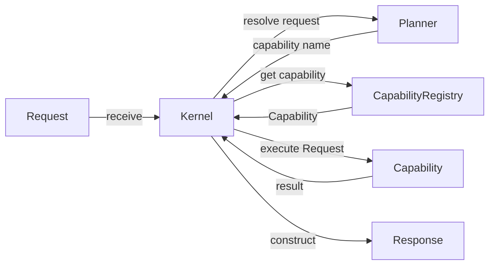
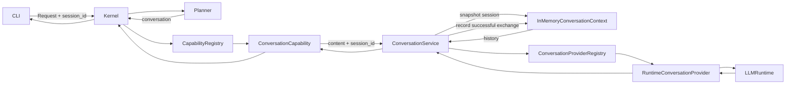

# Mapa de componentes actuales

<!-- MALAK_VAULT_SYNC:START -->
## Proyección automática de sincronización

> [!warning] Estado derivado pendiente de revisión
> Este bloque fue generado de forma determinista a partir de
> `Aranwill/jarvis/main`. No aprueba decisiones, no cierra
> sprints y no reemplaza la revisión humana del documento.

- **Run ID:** `20260920T010245047437Z_433e075b_980491c8`
- **HEAD oficial observado:** `433e075bb762cc5fb4bf11e18efe18a1faab7a2f`
- **Commit previamente observado:** `1b4bc19769344458e1af7943c45c34a2fb8a67e5`
- **Generado:** `2026-09-20T01:02:45.047437+00:00`
- **Prioridad:** `high`
- **Disposición:** `review_required`

### Estado estructurado de la fuente oficial

- **Ficha de sprint más reciente:** `docs/project/sprints/SPRINT-7.11.md`
- **Título declarado:** Sprint 7.11 — Reproducible Validation Pipeline Foundation
- **Estado declarado:** `completado`
- **`as_of_commit` declarado:** no disponible

### Commits oficiales observados

- 433e075bb762cc5fb4bf11e18efe18a1faab7a2f	Merge pull request #157 from Aranwill/test/e5-b1-readonly-explorer-red-20260919
- efa0488489aade3905ac15d27e00485e0e23bfcb	feat(e5): add deterministic read-only Explorer surface
- 9d5fd6a8918013def49fb37b07d5b304d80f0ffc	feat(e5): expose shared read-only Explorer readers
- 05abd126f8de5061799ea00dca095912cb699b61	test(e5): tighten B1 Explorer RED contract
- 116c3208c5ed3750028584a6c60c55de80120e92	test(e5): define B1 shared-reader RED contract
- 5cfce62c151f2bc2aec7368bf4ef6148a064f067	test(e5): define B1 Explorer CLI RED contract
- 166fdc1a7a43ab5b4ddd6400142704ba0030bb62	Merge pull request #156 from Aranwill/docs/e5-b1-readonly-explorer-g0-g1-20260919
- d62f7fb93624838de53a00ff57de140986f1b34c	docs(e5): define B1 read-only Explorer G0 G1 design
- 612adc758f3ce6f453c2b1aabe908a9826b6633c	docs(e5): add B1 Explorer G0 coverage ledger
- 3015e9baab7c6a810b2183b7d592933279bacc1e	Merge pull request #155 from Aranwill/test/e5-engineering-cli-red-20260919
- d10e0ebd6c9a565b10b334db0a16f6e4fd7bca45	test(e5): cover stateless Engineering service boundary
- 858f7faa253c7ab02a77f6ca13c08e41648af5a3	fix(e5): isolate stateless Engineering inference service
- c557c6f90f37dc25f473f7157fc853b503997479	feat(e5): add deterministic Engineering CLI surface
- 6dd40710825b4ccfec89a54ac0d092da06278807	feat(e5): compose Engineering kernels on one snapshot
- 3d862b2875bd793ea03bcbf258af121439ef6a52	test(e5): define Engineering composition RED contract
- b90cf689950e9582bb34e81ee2153977cfd54528	test(e5): define Engineering CLI RED contract
- 25f13acb2bcc29a1ad91afd0bec9cdff8c6bbb59	Merge pull request #154 from Aranwill/docs/e5-engineering-cli-g0-g1-design-20260919
- 368d82c017c43b930bfec27bcae6e092d7b702f9	docs(e5): tighten adaptive CLI design scope
- a897754f68cee71b2ba585b6ff35e6103765200a	docs(e5): define adaptive Engineering CLI G0 G1 design
- 774e2adb771d7eac2efce729b088d49f45221c69	docs(e5): add G0 coverage ledger
- e95ba30200f5d756e61ea79f6f49d3768439f131	Merge pull request #153 from Aranwill/docs/d1-engineering-intelligence-e4-state-reconciliation-20260919
- ffb4d31fb5be3dceb5396aa3e887454df130b4aa	docs(state): reconcile remaining E4 current-state blocks
- f9c8ae8160ba6c66c2bb8b28fe72fa8add54f9ef	docs(state): correct remaining current E4 authorization state
- 32913e51ae5a63dc446bd539a39dd5d96c9d09dc	docs(state): reconcile Engineering Intelligence E4 current state
- 7b1a2e15da443cbc307b007c0bc72a7d5c6b681e	Merge pull request #152 from Aranwill/test/e4-engineering-propose-red-20260919
- 6a3d5c0c135fb875f4084878272cae8a494abb0c	docs(e4): record GREEN authorization
- 306ed0b37b4308ca745ac9e8ab0c8088c7c94a3a	feat(e4): add grounded engineering propose capability
- e0803f5fec875c86c0b65c3c043578c0eede1b8a	test(e4): define engineering propose RED contract
- e463d43e40d2eac4cc6cb43a08ea9a695fcf901d	docs(e4): define engineering propose design
- ddb59e9edecc3da0a58cd3040545d555c99b1b0f	Merge pull request #151 from Aranwill/docs/d0-engineering-intelligence-state-reconciliation-20260919
- fd2bbf9da8b14135dcb331d01102e59b20b54987	docs(state): correct current reconciliation reference
- 02b84d658f179cd0951c9754a54a93da4178add1	docs(state): reconcile Engineering Intelligence E0-E3 current state
- 91ba6871389628edd7658948b0626d0a36b888f9	Merge pull request #150 from Aranwill/test/e3-engineering-analyze-red-20260919
- c5af9f528225faf7368e576a2338fa158a8f415b	docs(e3): require grounded findings and reserved ref tokens
- 912ff5ca16fdd2a9227041d2a0f1e4b26e7ba3ad	fix(e3): require grounded findings and reserve ref tokens
- 7e683a048730b0b512596357fb17515ddad1a395	test(e3): require grounded findings and reserve evidence tokens
- 2c749436687deb2391cd825f58a94bc5cb94529d	docs(e3): record complete-evidence and envelope hardening
- 27ef9bdacea0d7b91d042fd555d06e629973dbc6	fix(e3): fail closed on truncated analysis evidence
- 5cd50e6feb7bebdb83764905da600836023c7f17	test(e3): require complete evidence and explicit role boundaries
- 4dafee9d160d839979f16b53046cc9f112144bf5	fix(e3): protect rendered analysis text boundary
- 687dbcd9d827791f396e22bfded6a0c1aa32e0ed	test(e3): harden analysis schema and envelope boundaries
- b0a17850816a7bce3f78628e95efbcb8a75fd20e	feat(e3): add grounded engineering analyze capability
- 3583a99ed03214b4b0b966d971efe91d48c85aa7	refactor(e3): reuse shared evidence in engineering inspect
- 43fedf22d45533d8e54931444b3680c077d22878	refactor(e3): extract shared engineering evidence collector
- 6e370684b08574b906f867da43de2790633936f5	docs(e3): record owner GREEN authorization
- 6ec9e63e2eaa9c8857742e6514889861ec603249	test(e3): correct escaped control fixtures
- 73dabfe90a05b7bef8a276dae66e84864fc3cdce	test(e3): define engineering analyze RED contract
- 0aeb6c6974ce9272023430878d7a32a0f9508783	docs(e3): define engineering analyze design
- 49fa92ca648aacb5c46872d525215b7cfd47cb58	Merge pull request #149 from Aranwill/test/e2-engineering-inspect-red-20260919
- 5ce30d517736607a065b719f6f831035e0adb84b	test(e2): align injection fixture with available evidence refs
- 501a4f3638096452579bd852dd774f7f2297a345	docs(e2): require model citation binding
- 6818826b48e917f31a0b22ab37176858eab11184	fix(e2): validate model evidence citations
- c30c19cbd5768f28ea440748126e805e873127f3	test(e2): reject misbound and invented evidence citations
- 280aa5cb2dc201229c12df20d1c42a557422dd69	docs(e2): bind knowledge provenance at cognition boundary
- ac98dd68618c1ba0ce983c02faba62d45db72d58	fix(e2): bind governed knowledge evidence before inference
- 50d1da7ce6a5ebcf42c633759243ca10799f809e	test(e2): bind knowledge evidence before cognition
- 75123817ce7e9d7f8de8b7bc3a277a718361354c	feat(e2): add grounded engineering inspect capability
- ef20e545e0b42b87e2646a78d6d8e89c9f2c5a4a	docs(e2): record owner GREEN authorization
- 3b7e381fff23187ae186104cd100f812a7326039	test(e2): fix baseline mismatch RED fixture
- 1900655b62bd16de16d1b1b7e9a1b90d0c3b3f41	test(e2): define engineering inspect RED contract
- 58644ed72f20933bcfeb1f4f4e5285ab49833641	docs(e2): define engineering inspect design
- 5fee81f9fb6fd44a4dd7c16e45fdbf1868a340ae	Merge pull request #148 from Aranwill/test/e1-governed-knowledge-read-red-20260918
- 8cfeb201d2acb69905aed0a455730a42cf8f6caf	docs(e1): require exact repository provenance binding
- b5230d5cd6a19acbd94543a5c96b39a4677a8c0e	fix(e1): enforce source-to-repository provenance binding
- 985068f6ebc690a1648ba812b8f4b76252c5a5c4	test(e1): bind classified source to repository provenance
- 22ac9955bbdc99422efea3906b6e39beff4e57e4	docs(e1): separate document role from snapshot authority
- e74e06ca5bcde16b52ca06864aa1765081cfa108	docs(e1): close truncation and resource-bound ambiguity
- 46f90f581e9f88c363472c973745b0fb50b9fed2	fix(e1): prevalidate knowledge before truncated search output
- 97be38f850b9dcc9f3076634213144cb4f4ee0b5	test(e1): prevent truncation from hiding invalid knowledge
- b9ccb2257a4375fdf53c5a8e49cdd0b7675b81b2	feat(e1): add governed knowledge reader
- 8df6c4c685571baa50d73928ecf8a88ce812613d	feat(e1): add governed knowledge package
- a5016cefb2555b72b718474f762a5ffdbb2649bc	docs(e1): record owner GREEN authorization
- ff4ef1240318d20c27ed175709243be8081c653a	test(e1): define governed knowledge read RED contract
- 8cc15645a53f7b6a02161e5475e6201872ac3104	docs(e1): define governed knowledge read design
- ba1ddc1d3fe94f04c483c4e3520bd4b1b722444d	Merge pull request #147 from Aranwill/test/e0-repository-read-red-20260918
- 61dc6da874a2723d06029f9811badf1a32b47367	docs(e0): bound tree entries and repository paths
- 6522a2d8b0b2b7712ab5a1cfa3858a55e7c5d8ab	fix(e0): bound repository path and tree cardinality
- ad5dafa716808a687ba848f2639cf208ad761f06	test(e0): bound repository path and tree cardinality
- 8e45f45e4e664240b79dac3014d5a77e5555225a	fix(e0): bound search output and ambient Git state
- fa308b5db25b68c8f5bf48a5f51434b1eb6ba398	test(e0): harden search resource and environment bounds
- df82485b1c52e60cd05d4912562d1a7eb9cd3478	docs(e0): record owner authorization and search bounds
- da1127206050c072c7c40cbdf573f9f4fa619800	fix(e0): bound snapshot resources and verify blob identity
- 295f9bfc8093cacd349211a07ccce814489e9366	docs(e0): bound snapshot resources and blob identity
- 7f5721cac4c2f6442857d99570ebe9745a0921b3	test(e0): bound snapshot resources and verify blob identity
- 5efa29171fa4b55c6a9ffe6ddb7b5b3a453f885b	test(e0): make NUL-content fixture portable on Windows
- 93a40fd78298fb0a5af99ad4ca8257f4ec3d4965	fix(e0): isolate Git provenance from ambient state
- 91ab1089fec7718980a385e6be51aa2c56aaf74e	docs(e0): bind Git provenance against ambient state
- a4faa20e97c7bbf6ec040b9d3c2ef4676ecc9028	test(e0): bind Git inspection against environment and replace refs
- 9098bc0992a3ee3e5dea72b9d84a09d68f320fb6	feat(e0): add commit-bound repository reader
- 3d2f7a7695d77e8028f9105bc0fb5677298d2e25	docs(e0): make repository read bounds absolute
- c094ea76cb3b34a3af84ebd7a327dd561c9bc238	test(e0): enforce hard repository read bounds
- 0e0f7255fcc4649deb61ea1ac290d1fae8bfbe85	docs(e0): finalize hardened repository read contract
- 5feefaa4f78f5d8612d9ecb600947c1be44d8872	test(e0): close search and tree parsing ambiguity
- 61468f80d3596da402257a297deaa14e418ac061	docs(e0): close repository read ambiguity boundaries
- 1564b6975eaf778d7eb93c1cfdfdb7fd61db40a1	test(e0): harden repository read RED boundaries
- e2c65d294860b5d4ba77fcb9eb1caac5ddfc0a37	test(e0): define repository read RED contract
- 86d10a687753fbf07fd668ca1bee1a1ab358271a	docs(e0): define repository read proof design
- 5e55c32c01b2a100483aaa9bdd4274238784cc2f	Merge pull request #146 from Aranwill/test/g2p-b-persistence-authorization-red-20260917
- 96ed7df7829202d991ed159623088c0220f89a71	test(g2p-b): congelar preservación de created_at
- 7c203eb623587a585ccf204373f8624b9e360ecb	feat(g2p-b): componer solicitud de autorización de persistencia
- 833fb40da5bad24f516ecd1549763d30406ba5d2	test(g2p-b): definir RED de composición de autorización
- 72b61289915656fb86a7dee4e542a26380e9f51d	Merge pull request #145 from Aranwill/docs/g2p-b-persistence-authorization-composition-20260917
- 33269b7e877965cef4651041078329414edfef91	docs(g2p-b): endurecer fronteras de composición
- 1d48217e0443b75edc58b03615acfa4314b765f2	docs: definir candidate de composición de autorización G2P-B
- 527f3f3fa98d62b1d99782f5b04c017f8b32af2c	Merge pull request #144 from Aranwill/test/g2p-a-permission-operation-binding-red-20260916
- 9c2b2e3b39bd5d5ac8adbe414283566a45ecd2d1	feat(security): enforce operation permission binding
- 1a6032879312fe577de674ae6657f6c967b71af7	feat(security): record protected operation permission
- 51a3d1698d068814928c6ea1e7f2568fd2af847d	test(security): define G2P-A permission enforcement RED contract
- 0fa3a0d00d6619af29178d471672dc8f61078bf4	test(security): define G2P-A audit RED contract
- cdc49c69e1bfa76dd1d9959e9819074d7577bfcf	Merge pull request #143 from Aranwill/docs/remove-unauthorized-chatgpt-reviewer-attribution-20260916
- ad0b63ce8346ecd219247c9522320cbc2beb6353	docs: remove unauthorized ChatGPT reviewer attribution
- 13e6ce028ef7bd53c74bc2a6e1ebd8e7b62d3750	Merge pull request #142 from Aranwill/docs/adr-002-permission-operation-binding-amendment-20260915
- a6ccc41a208a73bab0e47ba0dbf2666cf7bf3ad1	docs(adr): remove ChatGPT reviewer attribution
- c7cee69364129e7a58f2ec2fe8a6eaa8e6f1e9a5	docs(adr): harden ADR-002 with required permission binding
- 39dd55b875388f5a5f2ffa9ef58f7f20cdccbf82	Merge pull request #141 from Aranwill/docs/adr-002-permission-operation-binding-hardening-20260915
- bd59f360c304723dd31e25454847c3aba0717533	docs(security): specify permission-operation binding hardening
- a1b19d8eafeab5ae7e1aabdf1347547e23b48448	Merge pull request #140 from Aranwill/feat/g2b-episodic-persistence-readiness-20260915
- 7aa6f322372376c783e71160a32233e7a478532c	fix(memory): harden readiness binding and upstream policy handling
- 5fe2fcfdb5ccb884eb1a82efa9584a3dbbed19fb	test(memory): harden persistence readiness fail-closed invariants
- 97dcfa948e7b7f72a30e5119d2ce17a983f27960	fix(memory): classify malformed persistence intent at readiness boundary
- ee1e79aae66ced3d7d88b40c1f8d5134a8bc67f2	feat(memory): export episodic persistence readiness contracts
- 9032e26a3d9c27b6ae8c6d09710039c969d65b3b	feat(memory): implement episodic persistence readiness G2B
- 025dda414e45df887f331cfb1ca29ead0fef89b7	test(memory): define episodic persistence readiness G2B
- 02c89be2ca0150b8380b2a9650846ea6fc2b8e66	Merge pull request #139 from Aranwill/feat/g2a-bound-authorization-enforcement-20260915
- fe3422dff38f1658d58949a6680bcab252642417	test(security): preserve audit positional field compatibility
- 3076b7a88ea7a5cb0becc827242cad073ea649a9	refactor(security): preserve audit positional compatibility
- bde809f19a2af4feed3ccfa2a80d5f68ac5b803e	test(security): cover requested and actual audit bindings
- 324fe51099a9c11be9ebe3ceed4ebe0c02b8e168	test(security): cover authorization operation binding contracts
- 325d062b803b2b72d6ce243c93701b97f2ac717c	test(security): cover exact PEP operation binding enforcement
- 9bb9142a71530dc997d350e67e8ce1d1ab39b744	test(security): cover bound PDP authorization semantics
- 92dd02d7a6d66574a791d0ef73533ef47d7d4492	feat(security): enforce exact protected operation binding
- 78b06ceb6bd18de2836a9d33ec082ac91cc25605	feat(security): preserve exact binding through policy decisions
- 07dcaff156bd0b458b237dc8774b680b9a2c70b5	feat(security): export authorization operation binding
- 52dcda8e151263fcaad19883129849c412898a88	feat(security): audit exact authorization operation binding
- 71faec9cd74926e41b08d7a86486b6e93d3685dd	feat(security): add exact authorization operation binding
- b52ae6bc4576870b99c33044512de71d4dba0a4f	test(security): define RED audit binding expectations
- e64c5cc46e42ea541f9b0b7489e153ef1c76ae73	Merge pull request #138 from Aranwill/docs/adr-002-bound-authorization-amendment-20260915
- 14a8f115275d686371e72dc21ab11a00516a5582	docs(adr): harden ADR-002 with bound authorization enforcement
- 77e4d95be6cc7b8c368922959ce3adc0a1cca7d7	Merge pull request #137 from Aranwill/docs/adr-002-bound-authorization-hardening-20260915
- 093510a0b340adf09e607ac00f555d370cf09454	docs(security): specify ADR-002 bound authorization hardening
- 59775f7aaa9df39075f12f85f2f33155bbf6bb10	Merge pull request #136 from Aranwill/docs/state-reconciliation-20260915
- 200efdc8c49a41cf9b4f24ae3106610ebcffffe2	docs(state): route current state through reconciliation record
- 7e8ad41adf24a97de3a2e3091ef66618bcf5c488	docs(state): record current-state reconciliation
- e4130a5fda955e2824216e2dc34fb4b2962403f7	docs(state): reconcile README with current baseline
- c554e36404e18c42e9834ba978541b936339df2f	Merge pull request #135 from Aranwill/docs/adr-template-reviewer-default
- 84478ffc03cf8ce71d2b771cbd123053d476747c	docs(adr): clear default reviewer attribution
- e31ec8ab37a0a9a9b3eb87474e023a23e61f961b	Merge pull request #134 from Aranwill/governance/cal-014-normative-activation
- dfb3cb8bc8f0a89c5bd121f46c80e2fe0c4c38ff	docs(governance): activate CAL-014 durable reliance law
- 3c811fb26d2c7cb7ab677594133768b3f6ce6896	Merge pull request #133 from Aranwill/docs/cal-014-reference-cleanup
- 16406fd7c83807d74049c4e7ca1305780d831212	docs(governance): fix CAL-014 candidate references
- bc9092110bc1858e29ab4024676e597c272dc964	Merge pull request #132 from Aranwill/docs/cal-014-exact-candidate-refresh
- f2012e0ef4a00bb1c81e3cbcb5c85af72174ef87	docs(governance): refresh CAL-014 exact normative candidates
- 48e19c9246e7f041c877595f2aeafccf0bcfd317	Merge pull request #131 from Aranwill/docs/cal-014-scope-interpretive-hardening
- 37e7e013a66ce044f8d4e30edae00f33d44d9605	docs(governance): harden CAL-014 interpretive boundaries after candidate merge
- 86766a7053baccb286dad2e1d132a5efb27fa724	Merge pull request #130 from Aranwill/docs/cal-014-exact-normative-candidates
- 0d14f8ba221d4dfed9fd67e15eff8b6388907130	docs(governance): add CAL-014 exact normative candidates
- 38856d96bc1d7f90cb6ffae5717bbf6e30d1aed7	Merge pull request #129 from Aranwill/design/cal-014-normative-promotion-scope-freeze
- 9a6de060fd2e8809c4df9f5942efce9cb2ad9d4f	docs(governance): harden CAL-014 normative promotion scope
- 8ace77dd2f6b27b143ed41ab9cbf48c09aa5fdfd	Merge pull request #128 from Aranwill/design/cal-014-durable-reliance-g0-g1
- 47b2a4ff7b0f48f6c2587f323b61308618ae7d91	docs(governance): harden CAL-014 review boundaries
- b81479ce5327f970127529e1858f2e8e4e8714d9	docs(governance): reopen CAL-014 durable reliance review
- 764c76bcf09243764d41ae6928554cdeab6c9c63	Merge pull request #127 from Aranwill/docs/malak-alignment-matrix
- 51b49983554e9338ab05800c4f5a564ceef9123c	docs(method): require Malak alignment matrix for material gates
- 1773568da3482f6995e63aa4bc151ff09657f22e	Merge pull request #126 from Aranwill/feat/episodic-content-identity-propagation-g2
- 55f880247400a437f05637a76301f1ee042a4f5a	test(memory): compact provenance coverage within G2 budget
- de8b782d1cc5cbab539b272dc6a0df76d21d3591	refactor(memory): compact governed consumption binding within budget
- f011a09c9c0d3b9bd0390323b5943e8e1fad1158	refactor(memory): compact content identity propagation within budget
- 5201c0e5587e44b9f2b6ca70703507b25616d4f5	test(memory): migrate governed consumption tests to content-bound v2
- ea381afcf2a31ccb08013d8aca1eae31876459c8	test(memory): migrate governed projection tests to content-bound v2
- f7ed0ccd548c7a04a23a460f6d1016edf3206d57	test(memory): migrate producer authorization tests to content-bound v2
- 4b38779b735ad9fc0cb3dc074888aa0ae94dd79b	test(memory): migrate provenance tests to content-bound v2
- ecb720faece3f7a6081e167283c2d723a100a3f2	feat(memory): verify candidate content identity at governed consumption
- 707098f91fc6a960b70a322f6b869d8f1d3049c8	feat(memory): bind governed projection to candidate content identity
- e15df08286a2a4e33afe757682a83b01eb07523d	feat(memory): bind producer authorization to candidate content identity
- 3745eb51d27826a81d93aa8338578b69c0391c79	feat(memory): bind assessment provenance to candidate content identity
- 3fb77c28f7f417240347f51f8e6cb23e4eb3898d	test(memory): seed content identity propagation G2 contract
- 2f6b7856191cb83dc8de5e3a36092fef9f3b92a5	Merge pull request #125 from Aranwill/spec/episodic-content-identity-propagation-g2
- 13647048a1df45dc03ca88115a27190dc4cf1d45	docs(memory): freeze content identity propagation G2 spec
- f726ca54240e7949370a98df30080a9802558e59	Merge pull request #124 from Aranwill/design/episodic-content-identity-propagation-g0-g1
- 932c2a6dbb03a0de077db908c1f896ccc354d1f7	docs(memory): harden propagation design for component compromise
- 389254954682428b400adb672904926db5561f4d	docs(memory): define content identity propagation G0/G1
- 2567c039fed9a6efe4a5749b0459b87970a20d5e	Merge pull request #123 from Aranwill/feat/episodic-candidate-content-identity-g2
- 066bb7ca98053590d001165901a0c924662966b6	test(memory): harden candidate content identity verification
- 85d557ce7d98db577e8f2e5eb98616f10a592429	feat(memory): implement episodic candidate content identity G2
- f7293812932d72507bb10cd06b04f6738ca2f277	test(memory): define candidate content identity G2 contract
- eecd1f68f353a011eae4663e18187129dcea5a25	Merge pull request #122 from Aranwill/spec/episodic-candidate-content-identity-g2
- 062093f731eada6534e9e27150a96c6122e6710e	docs(memory): correct normative content identity vectors
- 704a073896affee4613a5a007a904016427dee57	docs(memory): freeze candidate content identity G2 spec
- ae97970c43c8fb4e9897d0770bfb35feac2784a6	Merge pull request #121 from Aranwill/docs/post-g2-reconciliation-20260912
- 58580673dc7266bebdaa640a9d63326e62a1cec4	docs(state): reconcile implementation roadmap post-G2
- 1cb5d6ad6ebcbe46336b6da6a7ecee546c9e72af	docs(state): reconcile project context post-G2
- 4dc4f5c6e17858d451fde15dbe32cd39d7128c23	Merge pull request #120 from Aranwill/docs/research-evidence-input-20260912
- 94d6a3bd5c82b08d55485a01cb18156f2728754d	docs(research): fix evidence map whitespace
- 358a968a1e1c483dd4862b1a1227e4696bd750b7	docs(research): add implementation evidence map
- adb718b95bb7c009fb82a812501dcfa5a89bab87	Merge pull request #118 from Aranwill/feat/g2-assurance-signal-projection-20260911
- 94f125cfc2bf434d67dc91138aa9f469f6c59cf5	docs(cognition): record authorized G2 implementation candidate evidence
- c5cd8c5cf1222c3bf5c361ba746ead4e86d71b7c	docs(cognition): recalibrate G2 correction budget after F002
- 55a44b5e9691e2b2c137099564244d0d6e96e4c0	test(cognition): prove G2 cardinality guard short-circuits inspection
- 57fbcd6727c3de6c515f6af96c9580e5db794abf	fix(cognition): bound G2 cardinality before element inspection
- e6295e277eb8273905895207ab04ced70e2e7f9a	refactor(cognition): keep G2 projection within frozen LOC budget
- 38857fe755156b01a108b892770754b15f91f20d	feat(cognition): implement G2 assurance signal projection
- cd4915a66083f7fe360bbf78a26599b7d7d3a0d6	test(cognition): define G2 assurance signal projection RED contract
- b25c3012c8e8c890c105dde2faa6b147a123606d	Merge pull request #117 from docs/g2-assurance-signal-boundary-spec-20260911
- c450ac3e203f4b2ec2188f3f1c9b3222d8c01704	docs(cognition): harden G2 signal boundary specification
- 954f708b915209623d3ff0c2f0bf6f5a361deae0	docs(cognition): harden G2 signal authority scope
- 19e1761fa1d2a1307e01743003b75e1bcddee558	docs(cognition): freeze G2 assurance signal boundary spec
- cf75ae929e67e2dd5fbfdcea4d38a31ef53d534c	Merge pull request #116 from Aranwill/docs/reconcile-implementation-roadmap-post-g2a-20260911
- 458aa0cdf731cf9f92e3c08319e6e739c4a20b42	docs(state): reconcile implementation roadmap after G2A
- f6cc2952e33c8164ae9accb61c5835c160e11843	Merge pull request #115 from Aranwill/ci/ubuntu-windows-only-20260911
- 7a511b4b5452d5b529a7703df1024265783ee078	Merge pull request #114 from Aranwill/docs/reconcile-project-context-post-g2a-20260911
- 3049bb9f316a27cf910836b9c01be360c9cf1d3e	ci: limitar validación a ubuntu y windows
- 7aa40d260af92817f1dc53f180bc3831b1d8a8d3	docs(state): reconcile project context after G2A
- fcdc523babaf7b93952cd3d16afd11bcff392553	Merge pull request #111 from Aranwill/docs/assurance-signal-authority-g0-g1-20260911
- d7278fd965eda74872164c0daf3c5dd603979eea	docs(cognition): rebase assurance signal authority onto main
- 3636dac58fe24d769379ccc54086ed64e31122aa	feat(cognition): implementar G2A protected finalization foundation (#110)
- a27a366771726b16e7adeb98f4d5c29268876516	Merge pull request #109 from Aranwill/fix/f08-bounded-ollama-transport-20260911
- 39bf4bbf4e1418b10796cfd686d7c95aada79204	fix(runtime): bound Ollama transport payloads
- 5fdaac9d9c8e2ebe4738b04a6e089afa7f6a04c1	Merge pull request #108 from Aranwill/docs/f02c-blueprint-constitution-sync-20260911
- 27b05aadd2b6db70eb8fe738333d5058c7934338	docs(architecture): sync cognitive constitution in Blueprint
- 3b95cdd833d10dcb86492de96e0e4e6b94292e47	Merge pull request #107 from Aranwill/docs/f02a-roadmap-current-state-20260911
- db2a92b25bcf0cddf43cedb63e9820edf07b0426	docs(state): reconcile cognitive assurance roadmap status
- 01d2e2b0eecc30de4e875e52c5bee2a5a9d0b91b	Merge pull request #106 from Aranwill/owner/normative-traceability-hygiene-20260910
- 32601ee2e6bf80ac583a9c5f4cec585cbc320b85	docs(architecture): repair ADR traceability
- 2b993a23052fa75de9306427f87d9f8c3156c544	Merge pull request #105 from Aranwill/owner/evidence-bound-finalization-normative-activation-20260910
- 53de61b9718e26010d90bf6656dfac180dc65618	docs(governance): activate evidence-bound finalization
- b4f8a24535aa7c9ecd270f58043e0d95322ce3ef	Merge pull request #104 from Aranwill/docs/enforce-material-sprint-process-20260910
- 13ae08e8244ae5ab1443f86851f701ea1672cf6d	docs(process): enforce material sprint assurance and law boundary
- fa30b8d3b802c057016d4b7b46c8a9dc4572afab	Merge pull request #103 from Aranwill/docs/fix-normative-activation-consistency-20260910
- 461d5700b513c4b4a13e3f3feff5ae716a0d85d0	docs: correct normative activation packet consistency
- ae14c892a65c3243d8eca2981000998bef34f249	Merge pull request #102 from Aranwill/docs/cognitive-assurance-normative-promotion-candidate-20260910
- 120dc745fb5c9144a2716127307bdfb0bda83165	docs: propose evidence-bound finalization normative packet
- 48e9060ba946305b93c2fdf6a0aa5852a4dcb2fb	Merge pull request #101 from Aranwill/docs/cognitive-assurance-constitutional-impact-g0-g1-20260910
- 5b822c739e4643b48e657a97f20b4fe89a46d25b	docs: review cognitive assurance constitutional impact G0/G1
- 2f54ee8cf68bb45f569b2448228c80ae61dd5c2d	Merge pull request #100 from Aranwill/docs/reconcile-post-99-derived-state-20260910
- 7d7fdfe55bbff19906d8d1e3e945fcd21b770d00	docs: reconcile derived state after PR #99
- e0fb318c0e9cb521039b8b401dbf201602ef650b	Merge pull request #99 from Aranwill/docs/cognitive-assurance-g1-progressive-design-20260910
- 5d13d6862eb4faf91c0d6b5972aa6b70348294e4	docs: design progressive cognitive assurance G1
- cb1e06af8b424b498246f4e257985f83b55b1e98	Merge pull request #98 from Aranwill/docs/cognitive-assurance-g0-research-evidence-20260910
- 182a06e4cdb3bb7bc5b530c4ade72ecd5e4d3fe0	docs: record cognitive assurance G0 research evidence
- bf2b2a0dc721eef49768e41c586c91967e409847	Merge pull request #97 from Aranwill/docs/evidence-bound-cognition-foundation-20260910
- 8afcf4301ff4ad4db44a7fb7eb2b0f5c95cd04d8	docs(concepts): index evidence-bound cognition foundation
- 4f95a053117fbba1c4ef82acf893486818e619f9	docs(concepts): preserve evidence-bound cognition foundation
- ec5a97cafc158f721d7d59c19ae65b1d70ff7cd9	Merge pull request #96 from Aranwill/docs/agent-bounded-deterministic-change-rule-20260910
- 18a3edda0066246c693fc0873380117a1386ba78	docs(agents): require bounded deterministic modifications
- adaf7aa61d8e42cf08045acc5fabde5a80b24539	Merge pull request #95 from Aranwill/fix/revert-pr94-document-simplification-20260910
- d64a6dd5499a0b22303c3dba739b34232d6dee36	fix(docs): revert over-broad PR #94 simplification
- a6480415ca606499dc6f8e4fc44548f52d76a7ba	Merge pull request #94 from Aranwill/docs/reconcile-post-content-identity-g0-g1-20260910
- 133d0a15a86ba318205b625dbfa5838ae8588323	docs: preserve future planning and legacy disposition
- 1be57a9e51060bbde7e971a58c816478f07566ee	docs: reconcile research horizon after governed consumption
- 25a103aa159dfd8efddd6b5c130528b123a54f4b	docs: reconcile implementation roadmap post G3
- 3ef5214e2b178a9e4e22f22e4664d0fe5c603407	docs: reconcile project context post G3 and content identity G0/G1
- 841dac3d6e1c91b8fd04bc333d52e5f0a11e4176	docs: reconcile changelog through content identity G0/G1
- 4ab6dad25682cbc317a4a2378101ecd3a85b9376	Merge pull request #93 from Aranwill/docs/episodic-candidate-content-identity-g0-g1-20260910
- 453bf7c29b32139fa041492190e1f76ad1b34c98	docs: design episodic candidate content identity G0/G1
- bafeecc1ff3e60cfb8546d621ec08e0a8121fd56	Merge pull request #92 from Aranwill/feat/episodic-admission-governed-projection-consumption-g3-20260910
- 8c84bdf7fc584c8547ea768ab606ef7fdff4481b	feat: implement governed projection consumption
- c47ce9b0bd7ebfdb773306cb008bbf3de5362f07	test: specify governed projection consumption behavior
- 3db44ad282a1ccbfe52408c75f687fb190b8c0a0	Merge pull request #91 from Aranwill/spec/episodic-admission-governed-projection-consumption-g2-20260910
- e02219040c40b7ae11bda22d863f786d08214f6d	docs: specify governed projection consumption G2 candidate
- e564a6199ac4025bb993f5967594aed0c993058c	Merge pull request #90 from Aranwill/docs/episodic-admission-governed-projection-consumption-g0-g1-20260910
- 6dd7aaafe45d418c48339dcf5ef51b6c8a304680	docs: design governed projection consumption G0/G1
- 39a826325eee3daf62f1ec943a24463df5e9cf65	Merge pull request #89 from Aranwill/docs/reconcile-post-governed-projection-20260910
- 37bcbb1eb08cf7d01a954fec35854076718e4c2a	docs: reconcile project context after governed projection
- 007ca38e0cdd83a650509ca2b7b0c87ecbd0128f	docs: reconcile implementation roadmap after governed projection
- aff052328260953604b1444ec947a00809e6116c	docs: reconcile memory research horizon after governed projection
- 5df3673dc1acc2fec4b291f5a915f551fea359ad	docs: reconcile post-projection changelog state
- 0ff14dd5d8731e53f767fb0ecef613231166e1f7	Merge pull request #88 from Aranwill/feat/episodic-admission-governed-input-projection-g3-20260909
- dea2137620b95cb234b4de99d25de33e8fbe8c6c	feat: implement governed input projection
- 8f8569a01543617dc950b15f7d9c1d8c1f2a6c3e	test: specify governed input projection behavior
- 5ec120fb3b1cc9b1bf98420e81b32e062a0274d8	Merge pull request #87 from Aranwill/spec/episodic-admission-governed-input-projection-g2-20260909
- df0b0e83cf3803b78aa0269cdc2b70d026c34136	docs: specify governed episodic admission input projection G2 candidate
- da2090bfe8758f89f256351e9fd16e1279428b3e	Merge pull request #86 from Aranwill/design/episodic-admission-governed-input-projection-g1-20260909
- 0e2b8cf4520216b4f0d28ca44905230cae54cce7	docs: design governed episodic admission input projection G0/G1
- 914a0293990d630614782e4fa02f28770b18bd9c	Merge pull request #85 from Aranwill/impl/episodic-assessment-producer-authorization-g3-20260909
- 12cad1bd97714cd5b4f0d42e3ceec4441b2a4d89	test: correct non-UTC authorization case
- b009412cfe0a5c03f6cb55f9cbf15707c22b8aa4	feat: implement assessment producer authorization boundary
- e209a23b56f2db7c90289146786e0f4f9285741d	test: define assessment producer authorization G3 contract
- ab1d69fd8ea30912465473f06634c3a8c19a4b8d	Merge pull request #84 from Aranwill/spec/episodic-assessment-producer-authorization-g2-20260909
- 00b64f07287208279fc72efb98951c30a6a80ace	docs: specify assessment producer authorization G2 candidate
- 806e7a352ce2c1603de9b8186643ea7403f3ff05	Merge pull request #83 from Aranwill/design/episodic-assessment-producer-authorization-g1-20260909
- 00a8f46e8d217ef1f07225c1dd36d1583e54ff2f	docs: design episodic assessment producer authorization G0 G1
- 3473513d5577e4dc6d04f48928f22e4c1f752def	Merge pull request #82 from Aranwill/feat/episodic-assessment-provenance-g3-20260909
- 2a2dcf1218e8ff308c0f5d6b7b6bd4c615f89910	feat: implement episodic assessment provenance boundary
- b4a27ca8fc81d8489c9dc13e7975e3139e3e692e	test: define episodic assessment provenance contract
- e54539fd2fd026e031dedb19640d705137057460	Merge pull request #81 from Aranwill/spec/episodic-assessment-provenance-g2-20260909
- 46988be7c73314f6ed21d24bacb9d38c028a2fbb	docs: specify episodic assessment provenance candidate
- c090f8cf3788218799e7b7abad17ddeeced142be	Merge pull request #80 from Aranwill/design/episodic-assessment-provenance-g1-20260909
- 44044313a77496c0288c7b14a29158e249a239ac	docs: define episodic assessment provenance G0 G1 design
- 085422a021234b6aa2193474ab45996eea99ff22	Merge pull request #79 from Aranwill/ci/multi-os-pr-validation-20260909
- 64807e5015822607f5571e9aaa6c04bcef774f9e	ci: validate PR candidates across hosted OS runners
- acbcf05293c5b09ff04dbef1cc8ca4da7b8dbaaa	Merge pull request #78 from Aranwill/docs/reconcile-post-g3-research-horizon-20260909
- c2cdf1c800170bf4e53f7be37abda34e61b1f77b	docs: preserve research horizon final newline
- 46516bb0e22dff2c3a8e839ddb925f597639ab7f	docs: reconcile research horizon after G3
- 82947c12662fcaaecb12515dc35140f1eeaac515	Merge pull request #77 from Aranwill/docs/close-g3-episodic-admission-20260909
- 40b0e58768415e8022f19df7165050abcfc0827a	docs: reconcile integrated G3 episodic admission state
- a6e571e5aa7a867e24363f6083d7beee7a8ba924	Merge pull request #76 from Aranwill/g3/episodic-memory-admission-20260909
- 2198dd662ff50b70c6d4284ca727ce820a50b06c	feat(memory): implement episodic admission candidate
- 9cc32d6a8fabc47d650508744776999ffc4bb830	test(memory): define episodic admission candidate behavior
- 8d7668a56d7c3e29bd1e1ff9edb5bc23b8d2c814	Merge pull request #75 from Aranwill/g2/episodic-memory-admission-spec-20260909
- 134fc668442b30bcfc662b605f6aa46d418fda9f	docs: harden G2 episodic memory candidate specification
- cf4a1c5554a695bf4ef11d19710a7357e0606db6	docs: specify G2 episodic memory admission candidate
- c3148a8ad6ac708ca7f1db9b902b997b466ab734	Merge pull request #73 from Aranwill/g1/episodic-memory-admission-20260909
- 9a5cbd91c49feacc14000f34cca0e3ef8d4b4590	docs: harden G1 episodic memory admission design
- 1809958c0d33f96c43be0c8e70867127b7b82170	docs: record G1 episodic memory admission boundary design
- 5ddbd4648dd73bfc9c74ec1d5dc4c48f21d5dfd6	revert: keep G1 design isolated from main
- 092e866dd7a7f3900019dd12838a814f15456e46	docs: record G1 episodic memory admission boundary design
- 4161d64ae5616fc99de1239c55b94737a24ecf46	Merge pull request #71 from Aranwill/docs/security-policy-context-map-20260909
- 11ca100f6bc8983ca81c57fe32e9b34147f1c7ab	Merge pull request #70 from Aranwill/docs/research-horizon-security-reconciliation-20260909
- beb121bd02d5f195d4975d5564290765b7306ba6	docs: remove trailing whitespace from security header
- 904fb47c01317ba302b6da19e66ea9967f98a030	docs: record security policy and context mapping reconciliation
- 823459122f3773ebc80b94d62c8be0966054f355	docs: clarify security policy authority and future capabilities
- ba0a3416968bb2adb084c1ba450343f83f342f2f	docs: add security and research horizon PR checks
- a4a38b0e3ae2c95794b47b99e5fed94822ef143b	docs: add security horizon checks to development checklist
- 4846a472d85e9ede33ad0a38623ea74609ecee97	docs: include security and research horizon in construction admission
- 64cc44a239a1086b2d953d5035115be1fa1f0c6e	docs: make security and research horizon mandatory review inputs
- d899840f9a8ff3747d88562b28bf194080bdf397	docs: reconcile active security policy with current architecture
- afcc1db556109f663470a706520d3c082f2ac09c	docs: clarify world models vs autonomous self-modification
- 13b92d400d7efad6e0dcb977cdb433fc43c79182	docs: index Malak research horizon map
- 95e5c20e00e5297af13130e2c2b1bd73926a4209	docs: add Malak research horizon security reconciliation
- de5c0aa1c81267ef219d9521d9f020d4ec04a376	Merge pull request #69 from Aranwill/admission/constitutional-assurance-objective-invariants
- 999adcc79968ca38ebad5efe04266d454366c917	test: implement static architecture invariant detector
- d812ab782699de9552693f370aa8acaf03dc7c52	test: add RED architecture invariant scenarios
- 6d5427382638b3ef7be79d66a97cb5c01ae8dc42	docs: design objective architecture invariants
- c7dd772ebe0ece5e287bb7d52c83fdd69f75ef61	docs: add Constitutional Assurance G0 coverage ledger
- a3423bd713cd59c072b31fd7be3e6894a39bdb4b	Merge pull request #67 from Aranwill/docs/reconcile-sprint-7.11-state
- ddbcd6a62fdb27fad21c730ad541d1fb634eb74c	docs: restore exact project context formatting
- 2c9d900e62e28255cbc0ed020a3e99ae85922353	docs: correct stale Sprint 7.9 status
- bd9407d7cd179584c6e8fe459db7e11adf152c3f	docs: correct project context authorization wording
- 12aea5980f7f6f0c351418f0de14e1bb5ba0184c	docs: reconcile project context after Sprint 7.11
- a764fad53f9533d94a85eb3a79212817b81e51eb	docs: reconcile roadmap state after Sprint 7.11
- 31e2f23df9e2f27753f5a221d06de43e8a7acc32	docs: revert broad documentation compaction
- a27ec76a18b391d414f83b494a908bd19e555862	docs: preserve capability admission rule
- 8b2122167a101396e7e45f4e5f27c8704c66db10	docs: consolidate implementation roadmap after Sprint 7.11
- 4465e1e2cf5caadc9e61160f58fd6313736e5c96	docs: consolidate current project context after Sprint 7.11
- cc4c3422f8753856148f16306f0fb5473068369d	docs: reconcile changelog with Sprint 7.11
- 8d54209765d348d7d53dc200d92e8e14120b06b0	docs: consolidate Sprint 7.11 closure record
- 0cd5f0bf2ce887c03275168453d7fc31afa7aee5	Merge pull request #65 from Aranwill/feat/sprint-7.11-reproducible-validation-pipeline
- 51454959ba49c4eb040578c845e2144f341ba2ec	docs(sprint-7.11): close technical gates for final validation
- e4c3321119a5f50f79bd4b6b22ea07fdd4935f45	docs(sprint-7.11): record bounded CI bootstrap correction
- 78eec95239ecdd076ca2460283d145a03027a0b8	ci: use Node24-compatible official actions
- 1f952b9d917d2b6e0057d65a971545582275029b	ci: add read-only candidate validation pipeline
- ce006e4fd0d46ca57ca5db6a18b474a6a9c43851	docs(dev): document reproducible validation environment
- 595c48882f7967b6f75027dbc80e0490f228aa01	build(dev): declare pytest development dependency
- 24159afa0fbe4569b4a38afa77d5b23a1c0065fa	docs(sprint-7.11): authorize implementation and close G1
- 3b9a019f60763d05677d173ee7031fd940fe9811	docs: close Sprint 7.11 G0 and define minimal implementation contract
- a5e2968ca9eec4e7b558c6ca9035c76a6b954cdb	docs: close Sprint 7.11 admission coverage review
- 033c83d20ba0d2ef7b8d420527811c28cb43e041	docs: record Sprint 7.11 admission authorization
- 4cbfe62584162b4ee6e16e28870fc5b5b56ef743	Merge pull request #64 from Aranwill/feat/rdd-m1-evidence-foundation
- 8c7d755f2cf17f58b88c84689e7c18bfd27b16c4	docs(rdd): keep active evidence external to candidate
- 3a3f7fb3a962d5dd8fc87fa57e2f3a64363c3250	docs(rdd): clarify external active evidence semantics
- 81b44cc7fc77f726bbf0f71fda311991347b3f21	docs(rdd): prevent evidence identity recursion
- 94cba9b7fb0c1caee9b1794b445151630f525e28	test(rdd): cover validator result and binding diagnostics
- 0a9aefb7d4da7e3e28efcc976ddaf3eb42853455	fix(rdd): disambiguate validator result and binding evidence
- 7ed0b89b69ddc53e646ad087c23ac5b4ac340de0	docs(rdd): compact G0 coverage evidence
- 41b9da12deab3e599b6cd8dce1be7d469ba1c185	docs(rdd): simplify evidence manifest contract
- f15a1175013b6cd5c355cf99d8562e3628ad5183	docs(rdd): reduce admission record to essential scope
- d4b0e2faf802a8bf29e73a3ed0b56cad2b0502b0	test(rdd): cover baseline ancestry and result typing
- 50ba7e4e119285a0e2c49152f9466be6b69bd522	fix(rdd): harden manifest validation semantics
- 4a41f651dd674bc0f1bff62efaab575ed922583d	test(rdd): cover evidence manifest binding invariants
- ebbfad86e2195e13ae483e347817e369f96bfa82	feat(rdd): add candidate-bound manifest validator
- e25505cbc01f6120640866a892070f4a353e8f52	docs(rdd): define evidence manifest v1 contract
- fecda42bb06a75ad27726fa8134191aadce8ea59	docs(rdd): close G0 coverage review
- 4e9a4d8644da2c540b95c821555ebfccc7233d23	docs: record RDD-M1 admission and invariants
- f438290fb4f428ba9526bf369b26ce175eab0e2b	Merge pull request #63 from Aranwill/docs/gate9-admission-corrections
- 0d2a3f136d3ccb0166acc2d5553fe5931fcea883	docs(method): align receipt result semantics
- 6bbdf12aa01ffeec0884f700740564089fe492ef	docs(security): reconcile project identity
- a98d3b4c921fde433cc40bf291261bf9a0ef7a90	docs(repository): reconcile physical structure with baseline
- 0779ac79aef3911866391fa9d4b3b0ee56783551	docs(changelog): reconcile latest completed sprint
- 0f2b164da537372006dce9c4c18b45d22e8c91bc	Merge pull request #62 from Aranwill/docs/construction-method-hardening
- b7ae5f8d6f454a68b75974c86a6356cf9a4029f6	docs(method): clarify future-proposal disposition
- 896dab971a7609e3c59a145fcb0a60fd03d82b95	docs(agents): enforce exhaustive construction review protocol
- c531fb6c6bd7e3b6441fe2821f46ad7feaa47adf	docs(process): enforce exhaustive review and downstream reconciliation
- fc17d16ae99b39de0e75a9f7058007e03c99631f	docs(method): define governed Malak construction protocol
- 8e00a19b0f46469ba7322a0d444f8e5bb9230777	Merge pull request #61 from Aranwill/fix/post-sprint-readme-reconciliation-gate
- bca6353f1940920cf799590ffec2d20bde488273	docs(pr): add sprint closure reconciliation check
- 12a7c82559a65fc0ee6d82ec601e706dc61791ce	docs(process): require post-sprint README reconciliation
- 201587005a544aff0f0439a4ae03d14bf87b1ec3	docs(readme): reconcile Sprint 7.10 baseline
- 1908a780b0478ca0e857207205f3ba7a02ea4201	Merge pull request #60 from Aranwill/docs/post-7.10-baseline-reconciliation
- c604bda648ce61ec91aa130fd072f0ca17ca8f08	docs(project): reconcile post-7.10 planning baseline
- 4c4de3e3560d73b3df5198e23f5b5513e7566e16	Merge pull request #59 from Aranwill/docs/sprint-7.10-post-merge-closure
- de49b6476d301f81587429c1358814fe846d7904	docs(agents): require evidence-first gated implementation planning
- 7b1347a4a29db6ade1dd5a000b456e1e5ab7520e	docs(project): finalize sprint 7.10 post-merge state
- 02ce63dc26ba78e2a00948dad95dda2fd4c128d7	Merge pull request #58 from Aranwill/feat/sprint-7.10-session-isolation
- 28a6de1b57058f7859dc8bc1c63e900b15d6b478	docs(project): close sprint 7.10 session isolation
- 9cc568a7dfc8f4268ac1af809efee757e1aa31f9	feat(conversation): isolate in-memory context by session
- 20d67b344a15cca0c238e047e48991c9415e7d8e	refactor(capability): preserve request metadata across execution boundary
- c3cdf51e227c219da36cae38ef762c5c687f2de3	Merge pull request #57 from Aranwill/docs/agents-engineering-method-reference
- fc6994f0ba28229bfeb6342e75e8909861c14242	docs(agents): reference engineering method
- 6e35011c65d66b18b37633e0eb6db2eb67a60638	Merge pull request #56 from Aranwill/sprint/7.9-conversation-continuity
- c215d8d6895a6ba561f916b989478a8cef7f4c26	docs(sprint): close Sprint 7.9
- 17d686287a798138f3a0e100208158e663539db8	docs(project): reconcile Sprint 7.9 validated state
- cd76ab5dd7958413613e43dbdabee5cf9863ced2	docs(sprint): record Sprint 7.9 validation evidence
- 917e3435cd390b618d6d7dd272c14ea2bf2cc7f9	fix(cli): document new conversation command
- 8b3b811d189e1a0c614f5923b1a793aea18d9889	fix(conversation): enforce supported history roles
- b4bc782a78e88618391f8d2744335acc85333d11	feat(cli): add ephemeral conversation continuity
- 01daabf4116fa92600833ae8fd1e55d452556d2f	feat(runtime): adapt Ollama runtime to structured chat
- f521caa946112c868d58ba4ea2fd74aba1f2a7f7	feat(conversation): integrate bounded context into conversation service
- 0a0c2d0e036030de5991ac37fd90338992227e50	feat(conversation): add bounded in-memory conversation context
- 14570322bf47c23e384b2ae1e9ce35e5e0278e84	feat(conversation): extend conversation contract with history
- fa2a36633e1c074555faa625ff79241da09ac01e	docs(project): activate Sprint 7.9 conversation continuity
- f8988bb53d7403890f89fa42ecabb360f06d2b82	Merge pull request #55 from Aranwill/docs/context-retrieval
- 7393cad655cd0354cc39fc8982eaad7e0e624fe4	docs: establish context retrieval
- 100f092488764c4f5845e6a7bd494d10a8025053	Merge pull request #54 from Aranwill/fix/blueprint-metadata-consistency
- e6fd45b234e3eecb1621ff5a00f23ad3fcc93f1e	docs(architecture): decouple Blueprint status from implementation state
- 8dc1114aa3511606f7187b71327d35a8003cc522	Merge pull request #53 from Aranwill/fix/legacy-operational-closeout
- 957f8f4a7286ee974f2b57ee8b90de4932626846	docs(project): classify legacy operational artifacts
- e101555d1f6787bdcf82a1a644d7277097bf5364	Merge pull request #52 from Aranwill/fix/documentation-drift-closure
- a72fdf13409d5610ceef9802d4c89cbed935c267	docs(project): clean review safeguards formatting
- 68c7fa2e7d769dee082fe4463a340733d712d93f	docs(project): close documentation drift and add review safeguards
- 74e3f640daa1bdf5f4f213de9b12cc9e71b510c3	Merge pull request #51 from Aranwill/fix/pre-sprint-documentation-reconciliation
- 0e25cde5d889d7d575b989f5bde12adccc8ca119	docs(project): reconcile project context with Sprint 7.8 baseline
- 8d2ecb728a07bc3493d4fca89c6f9b9610b9b5f0	Merge pull request #50 from Aranwill/docs/human-only-pr-promotion
- 7b706a213c7f1ae921ff77f685b0869b227e6578	docs(agents): reserve PR promotion for human review
- 48ee359d0fdb14b4f90d154167d8b7a1b078e1ea	Merge pull request #49 from Aranwill/docs/repository-review-drift-discipline
- 2cef32f993d20c2967832032dbc81531536396fa	docs(agents): enforce repository review and drift discipline
- 1fb96d1cde883a9e43c72500d93c9fa9a8c12a54	Merge pull request #48 from Aranwill/docs/ephemeral-agent-execution-evidence
- 6668cdb1287b9be02281084e843da2d16890e61d	docs(concepts): preserve governed ephemeral agent execution model
- fe9e0c1ddc13e614236a20509bd69a4a29a2f83e	Merge pull request #47 from Aranwill/fix/documentation-engineering-principle-reconciliation
- 569dac6672d5a03da62976b0b2e7c65d3a857afe	docs(architecture): clean ADR index spacing
- 421748c6f9daddc7ff7e906cbe8f12bb8b32b213	docs(architecture): add specification and verification principle
- cf224dc63a615880e631271126a52eb8b1da2fff	docs(project): reconcile roadmap and Sprint 7.8 state
- 2f4b32962660d9e9d782014aab0ec18693e0a7b3	Merge pull request #46 from Aranwill/fix/sprint-7.8-closure-metadata
- 8551b7a9cec0c5128b67a1b7224d17d2019ba667	docs(project): reconcile Sprint 7.8 closure status
- 367c4e0084a633e5e0a91ae7db2f055c849a81e8	Merge pull request #45 from Aranwill/sprint/7.8-cognitive-conversation-execution-path
- ade83799b3e1917d8a00d074faee3808704442a8	docs(project): close Sprint 7.8 cognitive conversation path
- b64c95ff4fdd0f28a006f6bae0f39fab6a235a83	docs(project): complete Sprint 7.8 real runtime validation
- 896aca8fecfc5602660d5f8a4a71866490bb0f99	test(conversation): validate cognitive execution path
- 74fcc368e4a05ebb4b5b27730cc06d76ce34a091	feat(cli): route conversation through kernel
- 7968d0c89d495371c0ae8d9a3e6ca243252f5b9b	feat(app): compose conversation kernel
- e70706f0793da3adc8ff321bcabc4822f9912d9d	feat(planner): add deterministic capability routing
- 6922f62a7f215c090c9da2958a1d8c3f0abb322a	feat(conversation): add conversation capability adapter
- 1bd8b45049ca06f2b760c482cddb08653523a438	feat(kernel): add external composition seam
- 5ca9c5896bb278121d09488e720213ccda32b279	docs(project): activate Sprint 7.8 cognitive conversation path
- 2a8204e82a256a9d8d4b5b2d6f1223d3a5f288a6	Merge pull request #44 from Aranwill/fix/cross-repo-baseline-reconciliation
- b65cbec380410a3ea4061bf6b71a212c5e71ba58	docs(readme): align current baseline with Sprint 7.7
- 6c15d4e5ee495ffb7e8419f1e1225c59744fb4b3	docs(project): close Sprint 7.7 after promotion
- 2ed83865c1b8f63a98c413902559fd170de3a6d3	docs(project): complete Sprint 7.7-F final certification review
- 1fdd0dcb46c88d6aa9e0004c03ab3cc2ddc49e2f	docs(project): complete Sprint 7.7-E release readiness
- 3c03de050b0ec53a3d853e5dee65317afdd170d8	docs(project): complete Sprint 7.7-D security assurance
- 7f8adba6602e0d43e15096b42830e295c5a74fcb	docs(project): complete Sprint 7.7-C reconciliation
- df156d22633af798368a9d69e8a5695595cda886	docs(project): reconcile Sprint 7.7 derived documentation
- a7959501eac911f708f6196b67ece1bb49e177da	docs(project): complete Sprint 7.7-B technical validation
- bbfdc94e1c0729a55ddbb6a2a461eb834620b57f	fix(packaging): constrain Malak package discovery
- a168e64be0ca08492a6eaae22c96443e2606ae89	docs(project): complete Sprint 7.7-A evidence freeze
- 2f7308cf0d5dbeb9c17ed81180c46ae6c61968df	docs(project): activate Sprint 7.7 baseline certification
- 619b705b07df9f82e220add09c6b90a6b908b481	Merge pull request #43 from Aranwill/docs/sprint-7.6-final-reconciliation
- 152ffdc19548fce94a137b2699334eff5a1a1237	docs(project): reconcile Sprint 7.6 closure
- 880e64a24252688c477011a93810fa934cb60ad7	Merge pull request #42 from Aranwill/sprint/7.6-h-context-propagation-contract
- 4046e17742a8af8b1fd754b30fbf0161f9fa131f	Merge pull request #41 from Aranwill/sprint/7.6-g-context-validity-window
- 35840c9656b8434016b719822254377c2af26608	Merge pull request #40 from Aranwill/sprint/7.6-f-pdp-context-lifecycle
- dbc4dbf89e84bc89059f99e0719b1d24eff2f02d	feat(security): establish SecurityContext propagation contract
- c14ba496986399cecc7aa62facfad1a0c84e9f23	feat(security): enforce SecurityContext validity window
- bee7829c34f79e7ae762e0a14a35a3c8c4733528	feat(security): enforce SecurityContext lifecycle in PDP
- 941ea6832286b19eb7a4ab5380d3639c0c5dfc5c	feat(security): establish SecurityContextRenewer boundary
- c9a7758639aacc701337117741bdbb9a02d20647	feat(security): establish SecurityContextIssuer boundary
- d27521f1db2ff481a5fa05a4f7c80fdb9d78d71e	feat(security): establish SecurityContextValidator boundary
- e9aa1e1a4605af22eb34b6cdcbfabf7b5973d96c	feat(security): establish Clock boundary
- cf74ec462ac38209d825eaeabed0d9184a7fa210	Merge pull request #39 from Aranwill/sprint/7.6-a-security-context-contract
- 044cac5991c80855d1688a5451e8e691beabfd78	feat(security): establish SecurityContext lifecycle contract
- b6faf9d41d265c3ab5d3da63f3eee440bde91898	Merge pull request #38 from Aranwill/agent/directional-communication-rule
- b8f2ce2ec509101087b6c0a10aad9f47156dc3a5	docs: formalize directional communication and authority flow
- 03976211dbb7e8db95d4f55f365ff503e7f42a33	Merge pull request #37 from Aranwill/agent/engineering-method-sdd-tdd
- 50c0c5e9a6e13fc648a1b37f978a0d2cc4517d7a	docs: establish SDD TDD and risk-based engineering method
- 8942a8750f110d5d4d82afd7545c82dfbc6afc43	Merge pull request #36 from Aranwill/docs/concept-governance-clarification
- a2ed623cc3aa0399d2df6ee460da562988c7507d	docs(concepts): clarify projection authority
- 7a18db29e0260ec1c335416ba085902a3557637e	Merge pull request #35 from Aranwill/docs/cognitive-dataset-foundation
- 57d2133e95aaea361d228865f591100535ec587d	docs(concepts): index conceptual references
- a121fa3806c69f2d2124e9722aa53ef6b12ab641	docs(concepts): preserve governed swarm reference
- 3b56d90a5de966546f228044e4060866985745fa	docs(concepts): preserve cognitive dataset foundation
- c6ab6f898d866b22d147acc5b68afa9dbbb88637	Merge pull request #34 from Aranwill/docs/reconcile-project-context-after-idea-024
- e3174706088a4fa088d54a8724fb26758d41003c	docs(project): reconcile context after idea 024
- 27b061e0217bd3b962a949eb746d86ea831465a7	Merge pull request #33 from Aranwill/docs/add-governed-mission-orchestration-idea
- f5c87a9591d4b1ef641c78cc6712f569d22c3fa3	docs(ideas): add governed mission orchestration foundation
- ff983bd56fc3f34f8c879aaaa9b13100897ebbeb	Merge pull request #32 from Aranwill/docs/reconcile-project-context-2026-08-11
- cf4a415bc2162d6d6bf3d9423f743b734e438443	docs(project): reconcile current project context
- e95d277d34a85acb15d02b6ab531f1946d8e10e4	Merge pull request #31 from Aranwill/agent/reconcile-ideas-security-expansion
- d3770bfb286e6a9c18d9f7abfd164423debc962a	docs(ideas): reconcile security and research expansion
- 82126719dd696705561c4aa596d7553227e670c9	Merge pull request #30 from Aranwill/docs/reconcile-sprint-7.5-final-state
- 9441e872fba07bb8d06b2ba1fda30fca5f6becf6	docs(project): reconcile Sprint 7.5 final state
- 39435627ec61b46f4785ae8bd8ee114b54846fab	Merge pull request #29 from Aranwill/agent/sprint-7.5-integral-review-closure
- b4475724d7b60f57df8ce875ba73ed38b0f8c9cb	docs(security): close Sprint 7.5 integral review
- 48ef02ed4c6d94e40d9dd6885a33df66f479aad1	Merge pull request #28 from Aranwill/agent/sprint-7.5-audit-reconciliation
- d67965b387619073e8a46f677e198a513f800167	docs: reconcile sprint 7.5 authorization audit
- 372cbe3b79cf0070385d27cb00fb7ace57e28433	Merge pull request #27 from Aranwill/docs/strengthen-resource-governance-boundaries
- d094181671e0417688b6b342eaa4fb35d89a80be	docs(resources): strengthen resource governance boundaries
- 5212ddc572452b05b28c66754c3dfdf3b87002a7	Merge pull request #26 from Aranwill/docs/clarify-self-governance-wording
- d003964964d56cfd6f52ddbbc66eec21b16b8dfb	docs(governance): clarify self-validation under human authority
- 0783712e2f9e4d55323f478da6d30bb0851606c3	Merge pull request #25 from Aranwill/docs/clarify-governed-defense-boundaries
- 0fcfc99c3973e89474892a536ec1f1352d95b580	docs(security): clarify governed defense boundaries
- 436c7bc3dedebecae4bff895616b1480dd9f48b3	Merge pull request #24 from Aranwill/agent/record-segmented-scaling-and-active-defense
- c51ddc43908d9a7dee2af788c150e380955b7844	docs: record segmented scaling and governed active defense
- fa45863f54ad17d16903505ae5a4770b33a08859	Merge pull request #23 from Aranwill/agent/sprint-7.5-pep-audit-integration
- 4aad51042443dcca173b049c3d6770745db92cce	feat(security): integrate authorization audit into PEP
- cc85cd8ae04c7cf9bbca8aeb1dc3d0c9bb3acb9b	Merge pull request #22 from Aranwill/agent/sprint-7.5-authorization-audit-contracts
- 0ff448ed027c6cc8a9a7c7590518bc1832a8651f	feat(security): add authorization audit contracts
- 5c9d57a3305f655b0910fc2e2af52d72fce17f15	Merge pull request #21 from Aranwill/agent/record-high-value-evolution-ideas
- ecf29628c7609a5764bbb821f4b72a9fedd83110	docs(ideas): record validation and evolution foundations
- 7a49aae73f15d97c8eb7571a3db759af7e0fb892	Merge pull request #20 from Aranwill/agent/sprint-7.5-pep-doc-reconciliation
- 9d5f4bdc54815a6e25261d0c0044b94a6d53d429	docs: reconcile sprint 7.5 PEP integration
- 4d569623522f204fd6a11be4abcd220b05c1a947	Merge pull request #19 from Aranwill/agent/sprint-7.5-initial-pep
- dd4e5bad49b8efb9048e3d07dfd3675ce246dba3	feat(security): add initial policy enforcement point
- 840e7e00da31efaffe4ff3f62b438e8f9546340b	Merge pull request #18 from Aranwill/agent/sprint-7.5-pdp-doc-reconciliation
- 52e34dbf2e6be8e0e788c74f921ef20646fb4d4f	docs: reconcile sprint 7.5 PDP integration
- 552ba50d16f44ef1d8bed2b9f9004d745ec10d6c	Merge pull request #17 from Aranwill/agent/sprint-7.5-minimal-pdp
- 8b4b14b753de2ac6964d2221e22f0704a3de4f83	feat(security): add minimal policy decision point
- 67bbe8db6dbe20ca05fd7d4d93ebfe9a923e164d	Merge pull request #16 from Aranwill/docs/sprint-7.5-activation-reconciliation
- c0958202767b9e98a73c35b32b5e2f5ab7f6a0b1	fix(docs): repair roadmap encoding
- b8d9c2533d08983742b16ee32e24dea27c6e3c5a	docs(project): reconcile sprint 7.5 activation
- c0a1b5b6f12bcc4bf5c6670ddf43da3e6de49f77	Merge pull request #15 from Aranwill/feature/sprint-7.5-authorization-contracts
- 9e29c8110a32a15641ea94e91b82efc2f261738e	feat(security): add authorization contracts
- 8f7571bc7f0b15f3fe425a7579a45ea3b2fbdc0d	Merge pull request #14 from Aranwill/feature/sprint-7.4-logs-metrics-audit
- 6a73235d401a9d96433a9c833bd2f9c1a406c0aa	docs(sprint): record increment 7 technical closure
- fc751215d17c99c0ef3831b2c2725bd307ffbc45	docs(sprint): record increment 6 completion
- 656663ef055abe13efc631a5f5ecf89f55206bc4	docs(sprint): reconcile increment 5 record
- 46d59a27c99caba218daef50a9051507ecc6c9f6	docs(sprint): record increment 5 completion
- 854599c5be8689640b52b65f69dd30070c8084c9	feat(observability): integrate CLI operational events
- debfe2ebf936e42fe76b2b6a27ee4f87ef8c8143	docs(sprint): record sprint 7.4 progress
- 4efc3cc1f6702f11a4b0fdbb9e5443ad27c1232a	feat(observability): add operational event JSONL store
- 5f3ee2196b715ff5aa5f206562f49c455b9a7f99	feat(observability): add operational event sink and store
- ccd829b333a439f43387475afe9f760007053d61	feat(observability): add operational event contract
- a035374eb9bb9d6e2d4fb9ffc00d59e39116ef00	docs(vision): formalize future initiative registry
- 0a80b413b29175029c64d6bcb41e382c667bcd4b	docs(sprint-7.4): activate approved observability scope
- e7478bf41ffd0dd796ecc283f91754edfdf57c9f	Merge pull request #13 from Aranwill/feature/sprint-7.3-conversation-provider-boundary
- 1a170577693f3448122d1c895d46fc2e1114a7ce	docs(sprint): complete Sprint 7.3 record

### Evidencia que originó esta proyección

- `baseline-source-change` por `AGENTS.md`
- `baseline-source-change` por `docs/project/implementation_roadmap.md`
- `baseline-source-change` por `docs/project/project_context.md`
- `baseline-source-change` por `docs/project/sprints/SPRINT-7.10.md`
- `baseline-source-change` por `docs/project/sprints/SPRINT-7.11.md`
- `baseline-source-change` por `docs/project/sprints/SPRINT-7.3.md`
- `baseline-source-change` por `docs/project/sprints/SPRINT-7.4.md`
- `baseline-source-change` por `docs/project/sprints/SPRINT-7.9.md`
- `baseline-source-change` por `docs/project/sprints/proposals/CONSTITUTIONAL-ASSURANCE-G0-COVERAGE-LEDGER.md`
- `baseline-source-change` por `docs/project/sprints/proposals/EPISODIC-ADMISSION-ASSESSMENT-PRODUCER-AUTHORIZATION-G0-G1-DESIGN.md`
- `baseline-source-change` por `docs/project/sprints/proposals/EPISODIC-ADMISSION-ASSESSMENT-PRODUCER-AUTHORIZATION-G2-IMPLEMENTATION-CANDIDATE-SPEC.md`
- `baseline-source-change` por `docs/project/sprints/proposals/EPISODIC-ADMISSION-ASSESSMENT-PROVENANCE-G0-G1-DESIGN.md`
- `baseline-source-change` por `docs/project/sprints/proposals/EPISODIC-ADMISSION-ASSESSMENT-PROVENANCE-G2-IMPLEMENTATION-CANDIDATE-SPEC.md`
- `baseline-source-change` por `docs/project/sprints/proposals/EPISODIC-ADMISSION-GOVERNED-INPUT-PROJECTION-G0-G1-DESIGN.md`
- `baseline-source-change` por `docs/project/sprints/proposals/EPISODIC-ADMISSION-GOVERNED-INPUT-PROJECTION-G2-IMPLEMENTATION-CANDIDATE-SPEC.md`
- `baseline-source-change` por `docs/project/sprints/proposals/EPISODIC-ADMISSION-GOVERNED-PROJECTION-CONSUMPTION-G0-G1-DESIGN.md`
- `baseline-source-change` por `docs/project/sprints/proposals/EPISODIC-ADMISSION-GOVERNED-PROJECTION-CONSUMPTION-G2-IMPLEMENTATION-CANDIDATE-SPEC.md`
- `baseline-source-change` por `docs/project/sprints/proposals/EPISODIC-CANDIDATE-CONTENT-IDENTITY-G0-G1-DESIGN.md`
- `baseline-source-change` por `docs/project/sprints/proposals/EPISODIC-CANDIDATE-CONTENT-IDENTITY-PROPAGATION-G0-G1-DESIGN.md`
- `baseline-source-change` por `docs/project/sprints/proposals/EPISODIC-CANDIDATE-CONTENT-IDENTITY-PROPAGATION-G2-IMPLEMENTATION-CANDIDATE-SPEC.md`
- `baseline-source-change` por `docs/project/sprints/proposals/MALAK-ADR-002-BOUND-AUTHORIZATION-ENFORCEMENT-HARDENING-G2.md`
- `baseline-source-change` por `docs/project/sprints/proposals/MALAK-CAL-014-DURABLE-RELIANCE-CONSTITUTIONAL-IMPACT-G0-G1.md`
- `baseline-source-change` por `docs/project/sprints/proposals/MALAK-CAL-014-NORMATIVE-PROMOTION-SCOPE-FREEZE.md`
- `baseline-source-change` por `docs/project/sprints/proposals/MALAK-COGNITIVE-ASSURANCE-CONSTITUTIONAL-IMPACT-G0-G1.md`
- `baseline-source-change` por `docs/project/sprints/proposals/MALAK-COGNITIVE-ASSURANCE-G1-PROGRESSIVE-DESIGN.md`
- `baseline-source-change` por `docs/project/sprints/proposals/MALAK-COGNITIVE-ASSURANCE-NORMATIVE-PROMOTION-SCOPE-FREEZE.md`
- `baseline-source-change` por `docs/project/sprints/proposals/MALAK-E4-ENGINEERING-PROPOSE-G0-G1-DESIGN.md`
- `baseline-source-change` por `docs/project/sprints/proposals/MALAK-E5-B1-READONLY-EXPLORER-G0-COVERAGE-LEDGER.md`
- `baseline-source-change` por `docs/project/sprints/proposals/MALAK-E5-B1-READONLY-EXPLORER-G0-G1-DESIGN.md`
- `baseline-source-change` por `docs/project/sprints/proposals/MALAK-E5-ENGINEERING-CLI-G0-G1-DESIGN.md`
- `baseline-source-change` por `docs/project/sprints/proposals/MALAK-E5-G0-COVERAGE-LEDGER.md`
- `baseline-source-change` por `docs/project/sprints/proposals/RDD-M1-CANDIDATE-BOUND-EVIDENCE-FOUNDATION.md`
- `baseline-source-change` por `docs/project/sprints/proposals/RDD-M1-G0-COVERAGE-LEDGER.md`
- `baseline-source-change` por `docs/project/sprints/proposals/SPRINT-7.11-G0-COVERAGE-LEDGER.md`
- `baseline-source-change` por `docs/project/status/MALAK-POST-AUDIT-REBASELINE-20260911.md`
- `baseline-source-change` por `docs/project/status/MALAK-STATE-RECONCILIATION-20260915.md`
- `baseline-source-change` por `documents/projects/jarvis/ideas.md`
<!-- MALAK_VAULT_SYNC:END -->

<!-- MALAK_OPERATIONAL_STATE:START -->
## Estado operativo derivado

> Estado machine-owned derivado de la fuente oficial.
> No concede autoridad ni reemplaza decisiones humanas.

- **HEAD oficial:** `433e075bb762cc5fb4bf11e18efe18a1faab7a2f`
- **Ficha de sprint vigente:** `docs/project/sprints/SPRINT-7.11.md`
- **Titulo declarado:** Sprint 7.11 — Reproducible Validation Pipeline Foundation
- **Estado declarado:** `completado`
- **`as_of_commit` declarado:** no disponible
<!-- MALAK_OPERATIONAL_STATE:END -->

> [!warning] Naturaleza derivada
> Este documento representa únicamente relaciones verificadas en el repositorio oficial para el baseline indicado.
>
> No redefine la arquitectura, no documenta capacidades futuras y no posee autoridad operativa.

## 1. Alcance

Este mapa cubre las siguientes fronteras verificadas:

- `Request`;
- `Kernel`;
- `Planner`;
- `CapabilityRegistry`;
- `EchoCapability`;
- `ConversationCapability`;
- `ConversationService` y `ConversationProviderRegistry`;
- `InMemoryConversationContext` con continuidad efímera aislada por `session_id`;
- `RuntimeConversationProvider` y `LLMRuntime`;
- `Response`;
- CLI conversacional integrada mediante `Kernel.receive`;
- eventos operativos;
- stores operativos;
- contratos fundamentales de autorización;
- Policy Decision Point mínimo;
- Policy Enforcement Point inicial;
- Episodic Memory Admission Boundary;
- Assessment Provenance Boundary;
- Assessment Producer Authorization Boundary;
- Governed Input Projection Boundary;
- Governed Projection Consumption Boundary;
- G2A — Protected Finalization Foundation, aislada de la ruta conversacional real.
- G2 — Assurance Signal Authority & Projection Foundation, aislada de la ruta conversacional real.
- `GitRepositoryReader` — E0 Repository Read, read-only y commit-bound.
- `GovernedKnowledgeReader` — E1 Governed Knowledge Read, con clasificación documental explícita.
- `EngineeringInspectCapability` — E2 Engineering Inspect, inspección grounded y acotada.
- `EngineeringAnalyzeCapability` — E3 Engineering Analyze, comparación grounded entre evidencia de repositorio y conocimiento gobernado.
- `EngineeringProposeCapability` — E4 Engineering Propose, generación read-only de propuestas bounded para revisión humana.
- `collect_engineering_evidence(...)` — primitive privada compartida por E2–E4 para recopilar evidencia determinista y bounded.
- `_engineering_analysis.py` — primitive privada compartida por E3/E4 para análisis estructurado grounded.

Quedan fuera de alcance:

- detalle interno de proveedores y runtimes;
- métricas de runtime;
- auditoría de seguridad;
- auditoría de autorización;
- componentes propuestos en el roadmap;
- productores runtime de assurance signals todavía no autorizados;
- wiring de Protected Finalization con Conversation;
- E5 integración CLI del vertical de Engineering Intelligence;
- un runtime genérico/autónomo de Engineering Intelligence;
- agents, tools, writes o ejecución externa para el vertical de ingeniería.

Su exclusión de este documento no implica que no existan. Solamente evita mezclar subsistemas todavía no verificados dentro de este mapa.

Sprint 7.4 incorporó eventos operativos y correlación desde la CLI sin
modificar el flujo Kernel–Planner–Capability.

Sprint 7.8 integró la ruta conversacional dentro del pipeline
Kernel–Planner–Capability mediante `ConversationCapability`. La integración es
indirecta: el Kernel no depende directamente de `ConversationService`, providers
ni runtimes concretos.

Sprint 7.9 añadió continuidad conversacional efímera mediante
`InMemoryConversationContext`. Sprint 7.10 preservó el `Request` completo a través
de la frontera de Capability para propagar `session_id` y aislar historial por
sesión, sin persistencia ni Memory.

Después de Sprint 7.11 se integró incrementalmente una cadena episódica aislada
bajo `src/malak/memory/`: admisión, provenance de assessments, autorización del
producer, proyección gobernada de inputs y consumo gobernado de projections. La
cadena permanece separada de Conversation, no persiste ni recupera Memory y no
introduce estado en Kernel o `SecurityContext`.

PR #110 integró además G2A — Protected Finalization Foundation bajo
`src/malak/core/protected_finalization.py`. La foundation es determinista y
aislada: todavía no está conectada a `ConversationCapability`,
`ConversationService`, historial, Memory, Knowledge, providers o runtimes.

PR #118 integró G2 — Assurance Signal Authority & Projection Foundation bajo
`src/malak/core/assurance_signal_projection.py`. G2 valida observations
explícitas, binding de request/session/candidate, autorización del producer
sensible a kind+value, coherencia temporal, cardinalidad y compatibilidad de
policy antes de proyectar un `ProtectedFinalizationInput`. Permanece puro,
same-process y aislado de Conversation.

Después de ese baseline se integró una vertical acotada de Engineering
Intelligence mediante E0–E4. Estas unidades permiten observar un snapshot Git
exacto, recuperar conocimiento clasificado, inspeccionar evidencia, producir
análisis grounded y transformar findings elegibles en propuestas técnicas
bounded para revisión humana. La integración no añadió routing productivo en
Planner/CLI, writes, tools, agents ni autoridad operacional.

## 2. Referencia operativa del mapa

Este mapa deriva del repositorio oficial:

- **Repositorio:** `Aranwill/jarvis`
- **Rama:** `main`

El HEAD oficial, el sprint estructurado vigente y los demás datos operativos
que puedan derivarse de forma determinista pertenecen exclusivamente al bloque
`MALAK_OPERATIONAL_STATE`.

El cuerpo humano de este documento describe componentes, responsabilidades y
relaciones verificadas. No mantiene manualmente una copia del baseline
operativo vigente.

Las referencias a sprints que aparecen en las secciones de componentes se
conservan únicamente como provenance histórica de su incorporación.
## 3. Componentes verificados

### `Request`

Contrato de entrada recibido por el Kernel.

Fuente:

```text
src/malak/core/request.py
```

### `Kernel`

Punto de entrada del flujo gobernado mínimo.

Responsabilidades verificadas:

- crear el Planner;
- crear el Capability Registry;
- validar solicitudes vacías;
- solicitar al Planner una capability;
- recuperar la capability desde el registro;
- ejecutar la capability;
- construir la respuesta.

Fuente:

```text
src/malak/kernel/kernel.py
```

### `Planner`

Selector determinista de capability.

Comportamiento actual:

El Planner devuelve de forma determinista el nombre de capability configurado.
Su valor predeterminado continúa siendo `"echo"`, mientras que la composición
conversacional lo configura explícitamente con `"conversation"`.

Fuente:

```text
src/malak/services/planner.py
```

### `CapabilityRegistry`

Registro en memoria de capabilities disponibles.

Responsabilidades verificadas:

- registrar capabilities;
- impedir nombres duplicados;
- recuperar una capability por nombre;
- listar capabilities registradas;
- normalizar nombres a minúsculas.

Fuente:

```text
src/malak/kernel/registry.py
```

### `EchoCapability`

Capability disponible para el bootstrap mínimo basado en `echo`.

Fuente:

```text
src/malak/capabilities/echo.py
```

### `ConversationCapability`

Capability que adapta el contrato genérico de ejecución hacia
`ConversationService`.

La composición conversacional registra esta capability en un
`CapabilityRegistry` y configura el Planner con su nombre (`"conversation"`).

Fuentes:

```text
src/malak/capabilities/conversation.py
src/malak/app/composition.py
```

### `Response`

Contrato de salida construido por el Kernel.

Fuente:

```text
src/malak/core/response.py
```

### `OperationalEvent`

Contrato inmutable con allowlist de:

```text
event_name
component
occurred_at
outcome
request_id
reason_code
```

Fuente:

```text
src/malak/observability/operational_event.py
```

### `OperationalEventSink`

Contrato estructural de solo escritura:

```python
append(event: OperationalEvent) -> None
```

Fuente:

```text
src/malak/observability/operational_event_sink.py
```

### Stores operativos

Implementaciones verificadas:

```text
InMemoryOperationalEventStore
JsonlOperationalEventStore
```

Los stores permanecen separados de los stores de métricas.

Fuentes:

```text
src/malak/observability/operational_event_store.py
src/malak/observability/operational_event_jsonl_store.py
```

### Integración CLI

La CLI genera exclusivamente el `request_id` para cada intento
conversacional válido y emite:

```text
conversation.started
conversation.succeeded
conversation.failed
```

La dependencia del sink es opcional. `main()` no crea automáticamente
un store JSONL y no existe persistencia implícita.

Fuente:

```text
src/malak/app/cli.py
```

### Contratos fundamentales de autorización

El Sprint 7.5 incorporó cuatro contratos inmutables y desacoplados:

| Contrato | Responsabilidad verificada |
| --- | --- |
| `PermissionScope` | Identificar un recurso y una acción normalizados |
| `SecurityContext` | Identificar al sujeto y su estado de autenticación |
| `AuthorizationRequest` | Relacionar contexto, permiso, identificador y fecha trazable |
| `AuthorizationDecision` | Expresar un resultado binario y su razón |

Estos contratos:

- están expuestos mediante `malak.security`;
- separan solicitud y decisión;
- no ejecutan operaciones;
- no implementan políticas;
- no dependen de LLM;
- no modifican el Kernel, Planner ni runtimes.

Fuentes:

```text
src/malak/security/contracts.py
src/malak/security/__init__.py
tests/test_authorization_contracts.py
```

### Policy Decision Point mínimo

El Incremento 3 incorporó un punto de decisión determinista y
desacoplado:

| Componente | Responsabilidad verificada |
| --- | --- |
| `PolicyDecisionPoint` | Definir el contrato estructural de decisión |
| `StaticPolicyDecisionPoint` | Evaluar reglas exactas con denegación por defecto |
| `PolicyRule` | Relacionar sujeto, permiso y efecto explícitos |
| `PolicyEffect` | Representar `ALLOW`, `DENY` y `REQUIRE_HUMAN_CONFIRMATION` dentro del PDP |
| `HumanConfirmationEvidence` | Ligar de forma inmutable la confirmación a la solicitud original y a la nueva |
| `HumanConfirmationVerifier` | Separar la verificación de evidencia de la decisión |

La salida pública continúa siendo `AuthorizationDecision` binaria.
El PDP no admite comodines, herencia implícita, interpretación de texto
ni participación de LLM. La ausencia de regla, un sujeto no autenticado,
evidencia incongruente o un fallo del verificador producen denegación
segura.

El PDP no ejecuta operaciones. El enforcement permanece separado en el
PEP inicial descrito a continuación.

Fuentes:

```text
src/malak/security/pdp.py
src/malak/security/__init__.py
tests/test_policy_decision_point.py
docs/project/sprints/SPRINT-7.5.md
```

### Policy Enforcement Point inicial

El Incremento 4 incorporó una frontera de enforcement determinista y
fail-closed:

| Componente | Responsabilidad verificada |
| --- | --- |
| `PolicyEnforcementPoint` | Definir el contrato estructural de enforcement |
| `StrictPolicyEnforcementPoint` | Consultar al PDP inyectado, validar la decisión y controlar la ejecución |
| `ProtectedOperation` | Representar una operación protegida sin acoplarla al PEP |
| `AuthorizationDeniedError` | Diferenciar una denegación válida del PDP |
| `AuthorizationEnforcementError` | Bloquear fallos, tipos inválidos o decisiones incongruentes |

El PEP no acepta decisiones aportadas por el llamador. Consulta
directamente al PDP, verifica que la decisión corresponda al
`request_id` original y ejecuta la operación exactamente una vez solo
ante una autorización válida. Los fallos del PDP bloquean la operación;
los fallos de la operación se propagan sin reintento automático.

El incremento no conecta operaciones reales, no integra el PEP con
Kernel, Planner, CLI o runtimes y no incorpora todavía evidencia de
auditoría de autorización.

Fuentes:

```text
src/malak/security/pep.py
src/malak/security/__init__.py
tests/test_policy_enforcement_point.py
docs/architecture/adr/ADR-002-policy-enforcement-boundary.md
docs/project/sprints/SPRINT-7.5.md
```

### Episodic Memory Admission Boundary

Estado:

```text
implementado e integrado como unidad separada posterior a Sprint 7.11
```

Componentes públicos verificados:

- `EpisodicOrigin`;
- `EpisodicExperience`;
- `EpisodicAdmissionContext`;
- `EpisodicMemoryCandidate`;
- `EpisodicAdmissionSignals`;
- `SourceSecurityStatus`;
- `EpisodicAdmissionDecision`;
- `EpisodicAdmissionOutcome`;
- `EpisodicAdmissionReason`;
- `evaluate_episodic_candidate`.

La policy `episodic-admission/v1` produce únicamente:

```text
REJECT | HOLD | ELIGIBLE
```

Separaciones preservadas:

```text
candidate != decision
payload != control metadata
source authority != confidence != source security status != temporal validity != sensitivity
ELIGIBLE != persistence authorization
HOLD != retention authorization
admission != storage
```

La unidad es determinista y fail-closed. Fuentes tainted o revoked producen
`REJECT`; evaluaciones incompletas, fuentes suspect/unassessed, sensibilidad o
contradicciones pendientes producen `HOLD`.

No existe wiring con `ConversationCapability` o `ConversationService`,
persistencia, retrieval, Knowledge, cambio al Kernel ni ampliación de autoridad.

Fuentes:

```text
src/malak/memory/__init__.py
src/malak/memory/episodic_admission.py
tests/test_episodic_memory_admission.py
```

### Cadena episódica de assessment y proyección gobernada

Estado:

```text
implementada e integrada como unidades aisladas posteriores a Sprint 7.11
```

La cadena verificada es:

```text
EpisodicMemoryCandidate
        ↓
AdmissionAssessment
        ↓
Assessment Provenance
VALID | HOLD | INVALID
        ↓
Assessment Producer Authorization
AUTHORIZED | HOLD | DENIED
        ↓
Governed Input Projection
READY | HOLD | DENIED
        ↓
Governed Projection Consumption
BLOCKED | EVALUATED
        ↓
Episodic Admission
REJECT | HOLD | ELIGIBLE
```

La proyección gobernada reconstruye señales trust-sensitive a partir de
assessments candidate-bound con provenance y autorización verificadas; no confía
en campos de control sensibles por mera presencia y no aplica last-write-wins.

El consumo gobernado valida binding y policy-version, construye una vista
efímera con el contexto efectivo gobernado y delega exactamente una vez a
`evaluate_episodic_candidate(...)` únicamente cuando la projection es consumible.

La cadena no incorpora Conversation/runtime wiring, persistencia, retrieval,
Knowledge, cambios al Kernel ni ampliación de autoridad.

Fuentes:

```text
src/malak/memory/assessment_provenance.py
src/malak/memory/assessment_producer_authorization.py
src/malak/memory/governed_input_projection.py
src/malak/memory/governed_projection_consumption.py
```

### G2A — Protected Finalization Foundation

Estado:

```text
implementada e integrada como foundation determinista aislada
```

Contrato verificado:

```text
ProtectedResponseCandidate
        ↓
ProtectedFinalizationInput
        ↓
deterministic finalization evaluation
        ↓
ACCEPT | ABSTAIN | BLOCK
```

G2A separa generación de candidato y finalización protegida. No está conectada
a la ruta conversacional real, no llama providers ni LLMs, no lee o escribe
Memory/Knowledge, no persiste decisiones y no modifica Kernel,
ConversationService, ConversationCapability, CLI ni historial.

Fuentes:

```text
src/malak/core/protected_finalization.py
tests/test_protected_finalization.py
```

### G2 — Assurance Signal Authority & Projection Foundation

Estado:

```text
implementada e integrada como foundation determinista aislada
```

Contrato verificado:

```text
ProtectedResponseCandidate
        +
5 explicit AssuranceSignalObservation
        +
5 bound Producer Authorization Evidence
        ↓
Assurance Signal Authority / Projection
        ↓
READY | HOLD | DENIED
        ↓
ProtectedFinalizationInput only when READY
        ↓
existing G2A
```

G2 valida únicamente admisibilidad, binding, producer permission,
temporalidad, cardinalidad, versionado y coherencia del set. No decide que una
señal sea verdadera y no transforma Security ALLOW/DENY en una disposición
cognitiva.

```text
producer permission != signal truth
G2 READY != G2A ACCEPT
G2 DENIED != G2A BLOCK
```

El boundary permanece same-process y no afirma identidad criptográfica,
provenance criptográfica del `AuthorizationDecision`, replay protection ni
autenticidad de producers remotos.

El baseline todavía no posee productores runtime legítimos para:

```text
applicability
evidence_required
support_sufficient
contradiction_unresolved
policy_violation
```

Por tanto G2 sigue aislado y `Conversation G2B` permanece bloqueado y no
autorizado.

Fuentes:

```text
src/malak/core/assurance_signal_projection.py
tests/test_assurance_signal_projection.py
docs/project/sprints/proposals/MALAK-ASSURANCE-SIGNAL-BOUNDARY-G2-IMPLEMENTATION-CANDIDATE-SPEC.md
```

---

### Engineering Intelligence — E0–E4 bounded vertical

Estado verificado:

```text
E0 Repository Read          INTEGRATED
E1 Governed Knowledge Read  INTEGRATED
E2 Engineering Inspect      INTEGRATED
E3 Engineering Analyze      INTEGRATED
E4 Engineering Propose      INTEGRATED
E5 CLI Integration          DEFERRED / NOT AUTHORIZED
```

Relación implementada:

```text
GitRepositoryReader
        +
GovernedKnowledgeReader
        ↓
collect_engineering_evidence(...)
        ├─────────────────────────────┐
        ↓                             ↓
EngineeringInspectCapability   _engineering_analysis.py
        ↓                             ↓
grounded inspection            structured grounded analysis
                                      ├──────────────────────┐
                                      ↓                      ↓
                         EngineeringAnalyzeCapability  EngineeringProposeCapability
                                      ↓                      ↓
                               grounded findings       bounded proposals
                                      └──────────┬───────────┘
                                                 ↓
                                               Owner
```

E0 captura un snapshot Git exacto y expone lectura/búsqueda acotadas sobre
objetos del commit capturado. E1 clasifica únicamente fuentes documentales
reconocidas y preserva `source_class` / `authority_class` sin convertir esa
metadata en permiso.

E2–E4 reutilizan una primitive privada compartida para recopilar evidencia
bounded. E2 produce inspección read-only. E3 y E4 comparten una primitive privada
de análisis estructurado; E3 admite exclusivamente
`ALIGNED | PARTIAL | GAP | CONTRADICTION | UNRESOLVED`, mientras E4 solo puede
generar una propuesta adicional cuando existen findings grounded `GAP` o
`PARTIAL` y no hay `UNRESOLVED` ni `CONTRADICTION`. Ante evidencia
insuficiente o truncada relevante, el vertical degrada a resultados
no confirmados/fail-closed según el contrato correspondiente.

La integración E0–E4 no implica:

```text
analysis = decision
finding = authorization
proposal = decision
proposal = authorization
proposal = implementation
proposal = execution
evidence = authority
capability = planner/CLI wiring
integrated primitive = autonomous engineering runtime
```

No existe E5, wiring productivo de ingeniería en Planner/CLI, escritura de
repositorio, generic tool runner, agents ni ejecución externa autorizada por
esta vertical.

## 4. Flujo implementado

El Kernel mantiene un flujo genérico Kernel–Planner–Capability. Desde Sprint 7.10
la frontera de ejecución preserva el `Request` completo:



Esto preserva metadata existente —incluido `session_id`— sin almacenar contexto
en el Kernel ni introducir un DTO universal adicional.

## 5. Flujo operativo conversacional



`InMemoryConversationContext` mantiene historial únicamente en RAM, separado por
`session_id`, con un límite inicial de seis intercambios completos por sesión.
`clear(session_id)` no afecta otras sesiones y un fallo de generación no muta el
contexto. No existe persistencia, Memory, Knowledge ni sesión global/default
implícita cuando el contexto está habilitado.

La CLI conserva una UUID durante la conversación activa. `new` limpia solo esa
sesión, rota a una nueva UUID y continúa con una nueva frontera conversacional.

G2A no aparece en este diagrama porque no existe wiring autorizado ni
implementado entre Protected Finalization y la ruta conversacional vigente.

## 6. Secuencia funcional

1. La CLI construye un `Request` con contenido e identidad de sesión.
2. La CLI entrega el `Request` a `Kernel.receive`.
3. El Kernel obtiene la capability mediante Planner y `CapabilityRegistry`.
4. El Kernel ejecuta `Capability.execute(Request)`.
5. `ConversationCapability` preserva `content` y `session_id` y delega en `ConversationService`.
6. Con contexto habilitado, el servicio obtiene `snapshot(session_id)`; sin contexto conserva compatibilidad stateless.
7. El servicio resuelve el provider y genera la respuesta mediante `LLMRuntime`.
8. Solo tras éxito registra el intercambio en esa sesión; ante fallo el contexto permanece intacto.
9. El resultado vuelve al Kernel, que construye el `Response`.

Esta secuencia describe el runtime conversacional implementado actual. No debe
reinterpretarse como ejecución de G2A ni como autorización de G2B.

## 7. Bootstrap y composición verificados

El bootstrap mínimo basado en `echo` permanece disponible mediante:

```text
src/malak/kernel/bootstrap.py
```

Ese helper:

1. crea una instancia de `CapabilityRegistry`;
2. crea y registra `EchoCapability`;
3. devuelve el registro inicializado.

La ruta conversacional utiliza una composición distinta:

```text
src/malak/app/composition.py
```

`build_conversation_kernel()`:

1. crea `ConversationCapability`;
2. la registra en un `CapabilityRegistry`;
3. configura `Planner` con el nombre `"conversation"`;
4. construye el Kernel con ese Planner y ese registro.

## 8. Límites de la representación

Este mapa no afirma:

- que el Planner utilice un LLM;
- que exista planificación dinámica;
- que el Kernel invoque directamente un runtime LLM;
- que existan múltiples capabilities activas;
- que el registro sea persistente;
- que el diagrama represente toda la arquitectura de Malāk;
- que eventos operativos y métricas compartan contratos o stores;
- que exista auditoría de autorización;
- que la observabilidad adopte decisiones de autorización;
- que `ConversationRequest` contenga `request_id`;
- que los contratos de autorización concedan permisos por sí mismos;
- que la cadena episódica persista o recupere Memory;
- que G2A esté conectado a Conversation;
- que existan productores runtime autorizados de assurance signals;
- que Signal Boundary G2 o Conversation G2B estén autorizados;
- que E2/E3/E4 estén cableadas al Planner o a la CLI productiva;
- que exista E5 CLI Integration;
- que Engineering Intelligence pueda escribir, ejecutar tools o crear agents;
- que un finding, análisis o proposal conceda autoridad.

## 9. Hallazgos arquitectónicos descriptivos

Sin convertirlos en decisiones nuevas, el código observado muestra:

- selección de capability separada de su ejecución;
- resolución determinista en el Planner actual;
- registro desacoplado mediante el contrato `Capability`;
- bootstrap explícito de capabilities;
- respuesta final construida por el Kernel;
- tratamiento explícito de solicitudes vacías y capabilities inexistentes;
- generación exclusiva de `request_id` en la CLI;
- contratos operativos separados de las métricas;
- persistencia operativa opcional e inyectada;
- degradación controlada ante fallos del sink;
- Kernel, Planner y contratos conversacionales intactos;
- solicitud, contexto, permiso y decisión representados por contratos separados e inmutables;
- PDP determinista separado de la ejecución;
- reglas exactas y denegación por defecto;
- evidencia de confirmación inmutable y verificador inyectable;
- PEP separado del PDP y de la operación protegida;
- enforcement fail-closed con asociación estricta por `request_id`;
- cadena episódica aislada con provenance, producer authorization, projection y consumo gobernados;
- separación `Projection READY != Admission ELIGIBLE`;
- ausencia de persistencia y wiring conversacional en la cadena episódica;
- G2A determinista aislada de Conversation y sin autoridad para producir sus propios signals;
- E0 y E1 preservan un mismo baseline commit-bound para repositorio y conocimiento gobernado;
- E2–E4 consumen evidencia compartida bounded sin convertirla en autoridad;
- E3 exige binding de evidence refs para findings grounded y mantiene incertidumbre explícita;
- E4 exige binding `proposal → finding → evidence`, bloquea `UNRESOLVED` y `CONTRADICTION`, y devuelve la propuesta al Owner;
- ausencia de Planner/CLI wiring, E5, writes, tools, agents y ampliación automática de autoridad.

## 10. Fuentes oficiales

- `src/malak/kernel/kernel.py`
- `src/malak/kernel/bootstrap.py`
- `src/malak/kernel/registry.py`
- `src/malak/services/planner.py`
- `src/malak/contracts/capability.py`
- `src/malak/capabilities/echo.py`
- `src/malak/capabilities/conversation.py`
- `src/malak/capabilities/_engineering_evidence.py`
- `src/malak/capabilities/_engineering_analysis.py`
- `src/malak/capabilities/engineering_inspect.py`
- `src/malak/capabilities/engineering_analyze.py`
- `src/malak/capabilities/engineering_propose.py`
- `src/malak/infrastructure/repository_reader.py`
- `src/malak/knowledge/__init__.py`
- `src/malak/knowledge/knowledge_reader.py`
- `src/malak/app/composition.py`
- `src/malak/services/conversation_service.py`
- `src/malak/services/conversation_context.py`
- `src/malak/core/conversation_registry.py`
- `src/malak/providers/runtime_provider.py`
- `src/malak/core/llm_runtime.py`
- `src/malak/core/request.py`
- `src/malak/core/response.py`
- `src/malak/core/protected_finalization.py`
- `src/malak/app/cli.py`
- `src/malak/observability/operational_event.py`
- `src/malak/observability/operational_event_sink.py`
- `src/malak/observability/operational_event_store.py`
- `src/malak/observability/operational_event_jsonl_store.py`
- `src/malak/security/contracts.py`
- `src/malak/security/pdp.py`
- `src/malak/security/pep.py`
- `src/malak/security/__init__.py`
- `src/malak/memory/episodic_admission.py`
- `src/malak/memory/assessment_provenance.py`
- `src/malak/memory/assessment_producer_authorization.py`
- `src/malak/memory/governed_input_projection.py`
- `src/malak/memory/governed_projection_consumption.py`
- `tests/test_authorization_contracts.py`
- `tests/test_policy_decision_point.py`
- `tests/test_policy_enforcement_point.py`
- `tests/test_episodic_memory_admission.py`
- `tests/test_protected_finalization.py`
- `tests/test_repository_reader.py`
- `tests/test_knowledge_reader.py`
- `tests/test_engineering_inspect.py`
- `tests/test_engineering_analyze.py`
- `tests/test_engineering_propose.py`
- `docs/project/sprints/proposals/MALAK-E0-REPOSITORY-READ-PROOF-G0-G1-DESIGN.md`
- `docs/project/sprints/proposals/MALAK-E1-GOVERNED-KNOWLEDGE-READ-G0-G1-DESIGN.md`
- `docs/project/sprints/proposals/MALAK-E2-ENGINEERING-INSPECT-G0-G1-DESIGN.md`
- `docs/project/sprints/proposals/MALAK-E3-ENGINEERING-ANALYZE-G0-G1-DESIGN.md`
- `docs/project/sprints/proposals/MALAK-E4-ENGINEERING-PROPOSE-G0-G1-DESIGN.md`
- `docs/architecture/adr/ADR-002-policy-enforcement-boundary.md`
- `docs/project/sprints/SPRINT-7.4.md`
- `docs/project/sprints/SPRINT-7.5.md`
- `docs/project/sprints/SPRINT-7.9.md`
- `docs/project/sprints/SPRINT-7.10.md`
- `docs/project/sprints/proposals/MALAK-ASSURANCE-SIGNAL-AUTHORITY-G0-G1-DESIGN.md`

## 11. Navegación relacionada

- [[01-architecture/ARCHITECTURE_INDEX|Índice de arquitectura]]
- [[02-current-baseline/CURRENT_BASELINE|Baseline vigente]]
- [[08-session-context/MALAK_SESSION_CONTEXT|Contexto de sesión]]
- [[09-repository-snapshots/SNAPSHOT_INDEX|Índice de snapshots]]
- [[10-knowledge-index/KNOWLEDGE_INDEX|Índice maestro]]

## 12. Próximos mapas posibles

Los siguientes mapas permanecen pendientes y no están aprobados automáticamente:

- mapa detallado del subsistema conversacional;
- mapa detallado de métricas y eventos operativos;
- mapa de contratos actuales;
- mapa de límites del Kernel.

Cada uno deberá verificarse separadamente contra el repositorio oficial.
