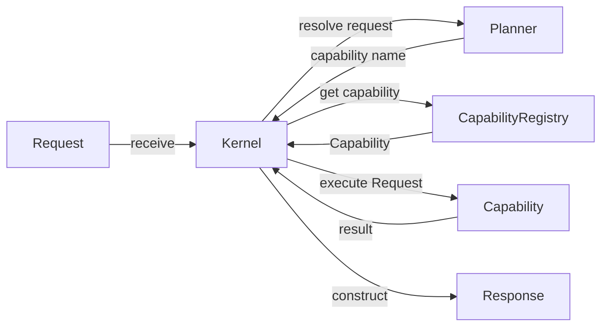
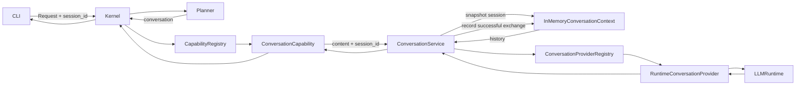

# Mapa de componentes actuales

<!-- MALAK_VAULT_SYNC:START -->
## Proyección automática de sincronización

> [!warning] Estado derivado pendiente de revisión
> Este bloque fue generado de forma determinista a partir de
> `Aranwill/jarvis/main`. No aprueba decisiones, no cierra
> sprints y no reemplaza la revisión humana del documento.

- **Run ID:** `20260923T235332157952Z_3716a701_a1942670`
- **HEAD oficial observado:** `3716a7019d475bb41b8d593b8a5725cfc3fb2c8c`
- **Commit previamente observado:** `1442463ec397c052e16d21378bfb11c3e0c48662`
- **Generado:** `2026-09-23T23:53:32.157952+00:00`
- **Prioridad:** `high`
- **Disposición:** `review_required`

### Estado estructurado de la fuente oficial

- **Ficha de sprint más reciente:** `docs/project/sprints/SPRINT-7.11.md`
- **Título declarado:** Sprint 7.11 — Reproducible Validation Pipeline Foundation
- **Estado declarado:** `completado`
- **`as_of_commit` declarado:** no disponible

### Commits oficiales observados

- 3716a7019d475bb41b8d593b8a5725cfc3fb2c8c	Merge pull request #184 from Aranwill/test/internal-interaction-test-v0-red-20260923
- 56023137dbfd2aca1db70d93d35cfe297eb0c917	docs: reconciliar primer slice ejecutable del Self-Review V0
- 1cd7b47ff612cf020a94eafd3108d989f7fc67c6	test: reconciliar RED con slice U01 ejecutable
- e60d16edcc2124d23b465b9b45f9f7150fa811f6	fix: acotar primer slice ejecutable del Self-Review V0
- 7eb1ad43f909d400fcbe03618f13ae3cdcb2cccb	test: agregar E2E gobernado del Self-Review V0
- 03d05b574e7901cdd7e5e1fb619903807bb0c9af	test: cubrir timeout Git del harness V0
- ff878f1f3524d562ad8a2c0c8606e98d0e8d73b7	hardening: acotar preflight Git de Self-Review V0
- 4750e46ab29c1c413cdedb15c75461cd3bcbf31a	fix: mantener summary mínimo gobernado en Self-Review V0
- b51d4234d16ddecc895ec4c19e57160b4f949f87	feat: integrar CLI Self-Review Test V0
- 1683d9a15b7d9daf459687b28b14b4824cdfc6a4	feat: agregar harness Internal Interaction Test V0
- ce04b630690709284eb91ad0d31eaf330b4bf9af	docs: autorizar GREEN de Internal Interaction Test V0
- 7be4e29777962d6a106520e4549b0568b18a8722	test: agregar RED de CLI Self-Review Test V0
- 57f0bdd8412218b3915805099268fe40b276243f	test: agregar RED del harness Internal Interaction Test V0
- 326165fef809546131c92727cfcc65403ea06250	docs: autorizar RED de Internal Interaction Test V0
- bd308d5f6bc221dd2582021de9abe00be3152191	Merge pull request #183 from Aranwill/docs/internal-interaction-test-v0-g0g1-20260923
- ed14b72f56701c353f419aa1def5d3d02a408486	docs: definir Internal Interaction Test V0 G0/G1
- 444b99a3a43c7c4e7863ed827b037c6895baa2e1	docs: mapear G0 de Internal Interaction Test V0
- 424febae61d6ab6f1f312efdb4bcad03f0cf79fd	Merge pull request #182 from Aranwill/test/live-replay-visual-projection-v0-red-20260923
- 37eddc41770294c0df3c4b52d03758f634d32827	docs: autorizar GREEN de Live Replay Visual Projection V0
- aefd0334b641e409cae945f0ea6f87ae2ac4e3ce	feat: integrar superficie CLI trace V0
- 3a4877c659c94530c6242af8cd3d9ea45f8e8a43	feat: agregar renderer y replay de trace V0
- 4e4334a43a127870080eadb4875161f31ace4335	feat: agregar proyección de trace V0
- 7e4f5348f9ebd9e60e0defe85910aeff719c6476	test: agregar RED de superficie CLI trace V0
- e263e9f1bc9cb3acf6a8f6e491340b5ac2d86e29	test: agregar RED de renderer y replay visual V0
- c0002af479b725b38f870ba2dff3bcd1e1c326d6	test: agregar RED de proyección visual de trace V0
- 86ea10422d35f1d0052903b905750123f259c77e	docs: autorizar RED de Live Replay Visual Projection V0
- 675121c3c3180c8436a6e436997247307b19207b	Merge pull request #181 from Aranwill/docs/live-replay-visual-projection-v0-g0g1-20260923
- 521a3223f7dbd8a1182fc40e69200d838eef3d3d	docs: define Live Replay Visual Projection V0 G0/G1
- c1b2bf9a7bfdf3682d1753ae5c6d5f0fa5e3f4e6	docs: map Live Replay Visual Projection V0 G0
- 0424cfeca7ca16fa59649b9bdfbe45f739030c25	Merge pull request #180 from Aranwill/test/internal-interaction-trace-v0-red-20260923
- 9ff8c1689e95075f7a04780d5c5a71823538c09d	docs: checkpoint Internal Interaction Trace V0 GREEN candidate
- ceedec2e078b9c950074e02561249054ce8dcce5	docs: authorize Internal Interaction Trace V0 GREEN
- c6e5b98b9dbf34ce9ca0e6f95d6b1844a4ef5f71	test: add real EngineeringKernelSet E2E validation
- 76909dd69740a77d77deb7932e5e62babd96c3c7	fix: bind runtime attestation and preserve operational outputs BC2
- 8920eda9025ad90f2576bd60bb3a541aa964e9b7	test: preserve consultable operational outputs BC2
- ec9fe34b6ecdc9a63f52583cf2c90fc293da9472	test: bind attestation metadata to run artifacts BC2
- 5025a482b96f909fa339aaf6830602b03c05f969	fix: timestamp live trace events with runtime clock BC2
- f8d45b2d79d1dc35c053a9fea0cfd567fb033e3d	test: require real-time trace timestamps BC2
- dca47fc01dd367322f48a41cbe32d7c1a9742aee	fix: correct canonical finding regex BC1
- 86122cddd528e556399a9ff50685303d27734bba	fix: close Internal Interaction V0 BC1 findings
- 6f62acb8b82b5616b3f3301418164e85ea7ae022	fix: harden trace semantics and replay validation BC1
- 87aacb1f19c208f78a27e0ced10a996ec9be9b9c	test: add bounded correction hardening cases BC1
- ca5e125e5c8343a3b0b762d17229e999d93c7de6	test: harden trace replay semantics BC1
- 6aee76d658a263bb4d6a665440695235518ef2ce	docs: record GREEN authorization for Internal Interaction V0
- 264e99a91ef56fc3ed3c4872edfa8ac6b3c5611f	feat: implement internal interaction runner V0
- c257aff32d13ce0cb635a9ccae0dbbc6bd6e21c3	feat: implement self-review evidence packet V0
- 0124e5f7ad01be58b047e2aed86fbfc8fa5b15c1	feat: implement execution trace V0
- 4d9a4e873d578b16c6de25e552b6073f30618970	test: add RED internal interaction runner V0
- 59a674bd79a610878558d141cde5c17ab01d57e4	test: add RED self-review evidence packet V0
- faed08a8da7d86f6bf02797faabb90a4aafa20b1	test: add RED execution trace contract V0
- a7ff3d7579e122c175a4680e2a171aa5679fa28c	docs: harden Internal Interaction Trace V0 before RED
- eb5a48fad12b8888192139e2b8a552bf50ce4870	Merge pull request #179 from Aranwill/docs/internal-interaction-trace-v0-g0g1-20260923
- c3a10cdbf5c3521e63b5b35582fb358c48db03ed	docs: define Internal Interaction Trace V0 G0/G1

### Evidencia que originó esta proyección

- `architecture-change` por `src/malak/app/cli.py`
- `architecture-change` por `src/malak/app/internal_interaction.py`
- `architecture-change` por `src/malak/app/internal_interaction_test_v0.py`
- `architecture-change` por `src/malak/app/trace_view.py`
- `architecture-change` por `src/malak/observability/execution_trace.py`
- `architecture-change` por `src/malak/observability/execution_trace_projection.py`
- `architecture-change` por `src/malak/services/self_review_evidence.py`
- `baseline-source-change` por `docs/project/sprints/proposals/MALAK-INTERNAL-INTERACTION-TEST-V0-G0-COVERAGE-LEDGER.md`
- `baseline-source-change` por `docs/project/sprints/proposals/MALAK-INTERNAL-INTERACTION-TEST-V0-G0-G1-DESIGN.md`
- `baseline-source-change` por `docs/project/sprints/proposals/MALAK-INTERNAL-INTERACTION-TRACE-V0-G0-G1-DESIGN.md`
- `baseline-source-change` por `docs/project/sprints/proposals/MALAK-LIVE-REPLAY-VISUAL-PROJECTION-V0-G0-COVERAGE-LEDGER.md`
- `baseline-source-change` por `docs/project/sprints/proposals/MALAK-LIVE-REPLAY-VISUAL-PROJECTION-V0-G0-G1-DESIGN.md`
<!-- MALAK_VAULT_SYNC:END -->

<!-- MALAK_OPERATIONAL_STATE:START -->
## Estado operativo derivado

> Estado machine-owned derivado de la fuente oficial.
> No concede autoridad ni reemplaza decisiones humanas.

- **HEAD oficial:** `3716a7019d475bb41b8d593b8a5725cfc3fb2c8c`
- **Ficha de sprint vigente:** `docs/project/sprints/SPRINT-7.11.md`
- **Titulo declarado:** Sprint 7.11 — Reproducible Validation Pipeline Foundation
- **Estado declarado:** `completado`
- **`as_of_commit` declarado:** no disponible
<!-- MALAK_OPERATIONAL_STATE:END -->

> [!warning] Naturaleza derivada
> Este documento representa únicamente relaciones verificadas en el repositorio oficial para el baseline indicado.
>
> No redefine la arquitectura, no documenta capacidades futuras y no posee autoridad operativa.

## 1. Alcance

Este mapa cubre las siguientes fronteras verificadas:

- `Request`;
- `Kernel`;
- `Planner`;
- `CapabilityRegistry`;
- `EchoCapability`;
- `ConversationCapability`;
- `ConversationService` y `ConversationProviderRegistry`;
- `InMemoryConversationContext` con continuidad efímera aislada por `session_id`;
- `RuntimeConversationProvider` y `LLMRuntime`;
- `Response`;
- CLI conversacional integrada mediante `Kernel.receive`;
- eventos operativos;
- stores operativos;
- contratos fundamentales de autorización;
- Policy Decision Point mínimo;
- Policy Enforcement Point inicial;
- Episodic Memory Admission Boundary;
- Assessment Provenance Boundary;
- Assessment Producer Authorization Boundary;
- Governed Input Projection Boundary;
- Governed Projection Consumption Boundary;
- G2A — Protected Finalization Foundation, aislada de la ruta conversacional real.
- G2 — Assurance Signal Authority & Projection Foundation, aislada de la ruta conversacional real.
- `GitRepositoryReader` — E0 Repository Read, read-only y commit-bound.
- `GovernedKnowledgeReader` — E1 Governed Knowledge Read, con clasificación documental explícita.
- `EngineeringInspectCapability` — E2 Engineering Inspect, inspección grounded y acotada.
- `EngineeringAnalyzeCapability` — E3 Engineering Analyze, comparación grounded entre evidencia de repositorio y conocimiento gobernado.
- `EngineeringProposeCapability` — E4 Engineering Propose, generación read-only de propuestas bounded para revisión humana.
- `collect_engineering_evidence(...)` — primitive privada compartida por E2–E4 para recopilar evidencia determinista y bounded.
- `_engineering_analysis.py` — primitive privada compartida por E3/E4 para análisis estructurado grounded.

Quedan fuera de alcance:

- detalle interno de proveedores y runtimes;
- métricas de runtime;
- auditoría de seguridad;
- auditoría de autorización;
- componentes propuestos en el roadmap;
- productores runtime de assurance signals todavía no autorizados;
- wiring de Protected Finalization con Conversation;
- E5 integración CLI del vertical de Engineering Intelligence;
- un runtime genérico/autónomo de Engineering Intelligence;
- agents, tools, writes o ejecución externa para el vertical de ingeniería.

Su exclusión de este documento no implica que no existan. Solamente evita mezclar subsistemas todavía no verificados dentro de este mapa.

Sprint 7.4 incorporó eventos operativos y correlación desde la CLI sin
modificar el flujo Kernel–Planner–Capability.

Sprint 7.8 integró la ruta conversacional dentro del pipeline
Kernel–Planner–Capability mediante `ConversationCapability`. La integración es
indirecta: el Kernel no depende directamente de `ConversationService`, providers
ni runtimes concretos.

Sprint 7.9 añadió continuidad conversacional efímera mediante
`InMemoryConversationContext`. Sprint 7.10 preservó el `Request` completo a través
de la frontera de Capability para propagar `session_id` y aislar historial por
sesión, sin persistencia ni Memory.

Después de Sprint 7.11 se integró incrementalmente una cadena episódica aislada
bajo `src/malak/memory/`: admisión, provenance de assessments, autorización del
producer, proyección gobernada de inputs y consumo gobernado de projections. La
cadena permanece separada de Conversation, no persiste ni recupera Memory y no
introduce estado en Kernel o `SecurityContext`.

PR #110 integró además G2A — Protected Finalization Foundation bajo
`src/malak/core/protected_finalization.py`. La foundation es determinista y
aislada: todavía no está conectada a `ConversationCapability`,
`ConversationService`, historial, Memory, Knowledge, providers o runtimes.

PR #118 integró G2 — Assurance Signal Authority & Projection Foundation bajo
`src/malak/core/assurance_signal_projection.py`. G2 valida observations
explícitas, binding de request/session/candidate, autorización del producer
sensible a kind+value, coherencia temporal, cardinalidad y compatibilidad de
policy antes de proyectar un `ProtectedFinalizationInput`. Permanece puro,
same-process y aislado de Conversation.

Después de ese baseline se integró una vertical acotada de Engineering
Intelligence mediante E0–E4. Estas unidades permiten observar un snapshot Git
exacto, recuperar conocimiento clasificado, inspeccionar evidencia, producir
análisis grounded y transformar findings elegibles en propuestas técnicas
bounded para revisión humana. La integración no añadió routing productivo en
Planner/CLI, writes, tools, agents ni autoridad operacional.

## 2. Referencia operativa del mapa

Este mapa deriva del repositorio oficial:

- **Repositorio:** `Aranwill/jarvis`
- **Rama:** `main`

El HEAD oficial, el sprint estructurado vigente y los demás datos operativos
que puedan derivarse de forma determinista pertenecen exclusivamente al bloque
`MALAK_OPERATIONAL_STATE`.

El cuerpo humano de este documento describe componentes, responsabilidades y
relaciones verificadas. No mantiene manualmente una copia del baseline
operativo vigente.

Las referencias a sprints que aparecen en las secciones de componentes se
conservan únicamente como provenance histórica de su incorporación.
## 3. Componentes verificados

### `Request`

Contrato de entrada recibido por el Kernel.

Fuente:

```text
src/malak/core/request.py
```

### `Kernel`

Punto de entrada del flujo gobernado mínimo.

Responsabilidades verificadas:

- crear el Planner;
- crear el Capability Registry;
- validar solicitudes vacías;
- solicitar al Planner una capability;
- recuperar la capability desde el registro;
- ejecutar la capability;
- construir la respuesta.

Fuente:

```text
src/malak/kernel/kernel.py
```

### `Planner`

Selector determinista de capability.

Comportamiento actual:

El Planner devuelve de forma determinista el nombre de capability configurado.
Su valor predeterminado continúa siendo `"echo"`, mientras que la composición
conversacional lo configura explícitamente con `"conversation"`.

Fuente:

```text
src/malak/services/planner.py
```

### `CapabilityRegistry`

Registro en memoria de capabilities disponibles.

Responsabilidades verificadas:

- registrar capabilities;
- impedir nombres duplicados;
- recuperar una capability por nombre;
- listar capabilities registradas;
- normalizar nombres a minúsculas.

Fuente:

```text
src/malak/kernel/registry.py
```

### `EchoCapability`

Capability disponible para el bootstrap mínimo basado en `echo`.

Fuente:

```text
src/malak/capabilities/echo.py
```

### `ConversationCapability`

Capability que adapta el contrato genérico de ejecución hacia
`ConversationService`.

La composición conversacional registra esta capability en un
`CapabilityRegistry` y configura el Planner con su nombre (`"conversation"`).

Fuentes:

```text
src/malak/capabilities/conversation.py
src/malak/app/composition.py
```

### `Response`

Contrato de salida construido por el Kernel.

Fuente:

```text
src/malak/core/response.py
```

### `OperationalEvent`

Contrato inmutable con allowlist de:

```text
event_name
component
occurred_at
outcome
request_id
reason_code
```

Fuente:

```text
src/malak/observability/operational_event.py
```

### `OperationalEventSink`

Contrato estructural de solo escritura:

```python
append(event: OperationalEvent) -> None
```

Fuente:

```text
src/malak/observability/operational_event_sink.py
```

### Stores operativos

Implementaciones verificadas:

```text
InMemoryOperationalEventStore
JsonlOperationalEventStore
```

Los stores permanecen separados de los stores de métricas.

Fuentes:

```text
src/malak/observability/operational_event_store.py
src/malak/observability/operational_event_jsonl_store.py
```

### Integración CLI

La CLI genera exclusivamente el `request_id` para cada intento
conversacional válido y emite:

```text
conversation.started
conversation.succeeded
conversation.failed
```

La dependencia del sink es opcional. `main()` no crea automáticamente
un store JSONL y no existe persistencia implícita.

Fuente:

```text
src/malak/app/cli.py
```

### Contratos fundamentales de autorización

El Sprint 7.5 incorporó cuatro contratos inmutables y desacoplados:

| Contrato | Responsabilidad verificada |
| --- | --- |
| `PermissionScope` | Identificar un recurso y una acción normalizados |
| `SecurityContext` | Identificar al sujeto y su estado de autenticación |
| `AuthorizationRequest` | Relacionar contexto, permiso, identificador y fecha trazable |
| `AuthorizationDecision` | Expresar un resultado binario y su razón |

Estos contratos:

- están expuestos mediante `malak.security`;
- separan solicitud y decisión;
- no ejecutan operaciones;
- no implementan políticas;
- no dependen de LLM;
- no modifican el Kernel, Planner ni runtimes.

Fuentes:

```text
src/malak/security/contracts.py
src/malak/security/__init__.py
tests/test_authorization_contracts.py
```

### Policy Decision Point mínimo

El Incremento 3 incorporó un punto de decisión determinista y
desacoplado:

| Componente | Responsabilidad verificada |
| --- | --- |
| `PolicyDecisionPoint` | Definir el contrato estructural de decisión |
| `StaticPolicyDecisionPoint` | Evaluar reglas exactas con denegación por defecto |
| `PolicyRule` | Relacionar sujeto, permiso y efecto explícitos |
| `PolicyEffect` | Representar `ALLOW`, `DENY` y `REQUIRE_HUMAN_CONFIRMATION` dentro del PDP |
| `HumanConfirmationEvidence` | Ligar de forma inmutable la confirmación a la solicitud original y a la nueva |
| `HumanConfirmationVerifier` | Separar la verificación de evidencia de la decisión |

La salida pública continúa siendo `AuthorizationDecision` binaria.
El PDP no admite comodines, herencia implícita, interpretación de texto
ni participación de LLM. La ausencia de regla, un sujeto no autenticado,
evidencia incongruente o un fallo del verificador producen denegación
segura.

El PDP no ejecuta operaciones. El enforcement permanece separado en el
PEP inicial descrito a continuación.

Fuentes:

```text
src/malak/security/pdp.py
src/malak/security/__init__.py
tests/test_policy_decision_point.py
docs/project/sprints/SPRINT-7.5.md
```

### Policy Enforcement Point inicial

El Incremento 4 incorporó una frontera de enforcement determinista y
fail-closed:

| Componente | Responsabilidad verificada |
| --- | --- |
| `PolicyEnforcementPoint` | Definir el contrato estructural de enforcement |
| `StrictPolicyEnforcementPoint` | Consultar al PDP inyectado, validar la decisión y controlar la ejecución |
| `ProtectedOperation` | Representar una operación protegida sin acoplarla al PEP |
| `AuthorizationDeniedError` | Diferenciar una denegación válida del PDP |
| `AuthorizationEnforcementError` | Bloquear fallos, tipos inválidos o decisiones incongruentes |

El PEP no acepta decisiones aportadas por el llamador. Consulta
directamente al PDP, verifica que la decisión corresponda al
`request_id` original y ejecuta la operación exactamente una vez solo
ante una autorización válida. Los fallos del PDP bloquean la operación;
los fallos de la operación se propagan sin reintento automático.

El incremento no conecta operaciones reales, no integra el PEP con
Kernel, Planner, CLI o runtimes y no incorpora todavía evidencia de
auditoría de autorización.

Fuentes:

```text
src/malak/security/pep.py
src/malak/security/__init__.py
tests/test_policy_enforcement_point.py
docs/architecture/adr/ADR-002-policy-enforcement-boundary.md
docs/project/sprints/SPRINT-7.5.md
```

### Episodic Memory Admission Boundary

Estado:

```text
implementado e integrado como unidad separada posterior a Sprint 7.11
```

Componentes públicos verificados:

- `EpisodicOrigin`;
- `EpisodicExperience`;
- `EpisodicAdmissionContext`;
- `EpisodicMemoryCandidate`;
- `EpisodicAdmissionSignals`;
- `SourceSecurityStatus`;
- `EpisodicAdmissionDecision`;
- `EpisodicAdmissionOutcome`;
- `EpisodicAdmissionReason`;
- `evaluate_episodic_candidate`.

La policy `episodic-admission/v1` produce únicamente:

```text
REJECT | HOLD | ELIGIBLE
```

Separaciones preservadas:

```text
candidate != decision
payload != control metadata
source authority != confidence != source security status != temporal validity != sensitivity
ELIGIBLE != persistence authorization
HOLD != retention authorization
admission != storage
```

La unidad es determinista y fail-closed. Fuentes tainted o revoked producen
`REJECT`; evaluaciones incompletas, fuentes suspect/unassessed, sensibilidad o
contradicciones pendientes producen `HOLD`.

No existe wiring con `ConversationCapability` o `ConversationService`,
persistencia, retrieval, Knowledge, cambio al Kernel ni ampliación de autoridad.

Fuentes:

```text
src/malak/memory/__init__.py
src/malak/memory/episodic_admission.py
tests/test_episodic_memory_admission.py
```

### Cadena episódica de assessment y proyección gobernada

Estado:

```text
implementada e integrada como unidades aisladas posteriores a Sprint 7.11
```

La cadena verificada es:

```text
EpisodicMemoryCandidate
        ↓
AdmissionAssessment
        ↓
Assessment Provenance
VALID | HOLD | INVALID
        ↓
Assessment Producer Authorization
AUTHORIZED | HOLD | DENIED
        ↓
Governed Input Projection
READY | HOLD | DENIED
        ↓
Governed Projection Consumption
BLOCKED | EVALUATED
        ↓
Episodic Admission
REJECT | HOLD | ELIGIBLE
```

La proyección gobernada reconstruye señales trust-sensitive a partir de
assessments candidate-bound con provenance y autorización verificadas; no confía
en campos de control sensibles por mera presencia y no aplica last-write-wins.

El consumo gobernado valida binding y policy-version, construye una vista
efímera con el contexto efectivo gobernado y delega exactamente una vez a
`evaluate_episodic_candidate(...)` únicamente cuando la projection es consumible.

La cadena no incorpora Conversation/runtime wiring, persistencia, retrieval,
Knowledge, cambios al Kernel ni ampliación de autoridad.

Fuentes:

```text
src/malak/memory/assessment_provenance.py
src/malak/memory/assessment_producer_authorization.py
src/malak/memory/governed_input_projection.py
src/malak/memory/governed_projection_consumption.py
```

### G2A — Protected Finalization Foundation

Estado:

```text
implementada e integrada como foundation determinista aislada
```

Contrato verificado:

```text
ProtectedResponseCandidate
        ↓
ProtectedFinalizationInput
        ↓
deterministic finalization evaluation
        ↓
ACCEPT | ABSTAIN | BLOCK
```

G2A separa generación de candidato y finalización protegida. No está conectada
a la ruta conversacional real, no llama providers ni LLMs, no lee o escribe
Memory/Knowledge, no persiste decisiones y no modifica Kernel,
ConversationService, ConversationCapability, CLI ni historial.

Fuentes:

```text
src/malak/core/protected_finalization.py
tests/test_protected_finalization.py
```

### G2 — Assurance Signal Authority & Projection Foundation

Estado:

```text
implementada e integrada como foundation determinista aislada
```

Contrato verificado:

```text
ProtectedResponseCandidate
        +
5 explicit AssuranceSignalObservation
        +
5 bound Producer Authorization Evidence
        ↓
Assurance Signal Authority / Projection
        ↓
READY | HOLD | DENIED
        ↓
ProtectedFinalizationInput only when READY
        ↓
existing G2A
```

G2 valida únicamente admisibilidad, binding, producer permission,
temporalidad, cardinalidad, versionado y coherencia del set. No decide que una
señal sea verdadera y no transforma Security ALLOW/DENY en una disposición
cognitiva.

```text
producer permission != signal truth
G2 READY != G2A ACCEPT
G2 DENIED != G2A BLOCK
```

El boundary permanece same-process y no afirma identidad criptográfica,
provenance criptográfica del `AuthorizationDecision`, replay protection ni
autenticidad de producers remotos.

El baseline todavía no posee productores runtime legítimos para:

```text
applicability
evidence_required
support_sufficient
contradiction_unresolved
policy_violation
```

Por tanto G2 sigue aislado y `Conversation G2B` permanece bloqueado y no
autorizado.

Fuentes:

```text
src/malak/core/assurance_signal_projection.py
tests/test_assurance_signal_projection.py
docs/project/sprints/proposals/MALAK-ASSURANCE-SIGNAL-BOUNDARY-G2-IMPLEMENTATION-CANDIDATE-SPEC.md
```

---

### Engineering Intelligence — E0–E4 bounded vertical

Estado verificado:

```text
E0 Repository Read          INTEGRATED
E1 Governed Knowledge Read  INTEGRATED
E2 Engineering Inspect      INTEGRATED
E3 Engineering Analyze      INTEGRATED
E4 Engineering Propose      INTEGRATED
E5 CLI Integration          DEFERRED / NOT AUTHORIZED
```

Relación implementada:

```text
GitRepositoryReader
        +
GovernedKnowledgeReader
        ↓
collect_engineering_evidence(...)
        ├─────────────────────────────┐
        ↓                             ↓
EngineeringInspectCapability   _engineering_analysis.py
        ↓                             ↓
grounded inspection            structured grounded analysis
                                      ├──────────────────────┐
                                      ↓                      ↓
                         EngineeringAnalyzeCapability  EngineeringProposeCapability
                                      ↓                      ↓
                               grounded findings       bounded proposals
                                      └──────────┬───────────┘
                                                 ↓
                                               Owner
```

E0 captura un snapshot Git exacto y expone lectura/búsqueda acotadas sobre
objetos del commit capturado. E1 clasifica únicamente fuentes documentales
reconocidas y preserva `source_class` / `authority_class` sin convertir esa
metadata en permiso.

E2–E4 reutilizan una primitive privada compartida para recopilar evidencia
bounded. E2 produce inspección read-only. E3 y E4 comparten una primitive privada
de análisis estructurado; E3 admite exclusivamente
`ALIGNED | PARTIAL | GAP | CONTRADICTION | UNRESOLVED`, mientras E4 solo puede
generar una propuesta adicional cuando existen findings grounded `GAP` o
`PARTIAL` y no hay `UNRESOLVED` ni `CONTRADICTION`. Ante evidencia
insuficiente o truncada relevante, el vertical degrada a resultados
no confirmados/fail-closed según el contrato correspondiente.

La integración E0–E4 no implica:

```text
analysis = decision
finding = authorization
proposal = decision
proposal = authorization
proposal = implementation
proposal = execution
evidence = authority
capability = planner/CLI wiring
integrated primitive = autonomous engineering runtime
```

No existe E5, wiring productivo de ingeniería en Planner/CLI, escritura de
repositorio, generic tool runner, agents ni ejecución externa autorizada por
esta vertical.

## 4. Flujo implementado

El Kernel mantiene un flujo genérico Kernel–Planner–Capability. Desde Sprint 7.10
la frontera de ejecución preserva el `Request` completo:



Esto preserva metadata existente —incluido `session_id`— sin almacenar contexto
en el Kernel ni introducir un DTO universal adicional.

## 5. Flujo operativo conversacional



`InMemoryConversationContext` mantiene historial únicamente en RAM, separado por
`session_id`, con un límite inicial de seis intercambios completos por sesión.
`clear(session_id)` no afecta otras sesiones y un fallo de generación no muta el
contexto. No existe persistencia, Memory, Knowledge ni sesión global/default
implícita cuando el contexto está habilitado.

La CLI conserva una UUID durante la conversación activa. `new` limpia solo esa
sesión, rota a una nueva UUID y continúa con una nueva frontera conversacional.

G2A no aparece en este diagrama porque no existe wiring autorizado ni
implementado entre Protected Finalization y la ruta conversacional vigente.

## 6. Secuencia funcional

1. La CLI construye un `Request` con contenido e identidad de sesión.
2. La CLI entrega el `Request` a `Kernel.receive`.
3. El Kernel obtiene la capability mediante Planner y `CapabilityRegistry`.
4. El Kernel ejecuta `Capability.execute(Request)`.
5. `ConversationCapability` preserva `content` y `session_id` y delega en `ConversationService`.
6. Con contexto habilitado, el servicio obtiene `snapshot(session_id)`; sin contexto conserva compatibilidad stateless.
7. El servicio resuelve el provider y genera la respuesta mediante `LLMRuntime`.
8. Solo tras éxito registra el intercambio en esa sesión; ante fallo el contexto permanece intacto.
9. El resultado vuelve al Kernel, que construye el `Response`.

Esta secuencia describe el runtime conversacional implementado actual. No debe
reinterpretarse como ejecución de G2A ni como autorización de G2B.

## 7. Bootstrap y composición verificados

El bootstrap mínimo basado en `echo` permanece disponible mediante:

```text
src/malak/kernel/bootstrap.py
```

Ese helper:

1. crea una instancia de `CapabilityRegistry`;
2. crea y registra `EchoCapability`;
3. devuelve el registro inicializado.

La ruta conversacional utiliza una composición distinta:

```text
src/malak/app/composition.py
```

`build_conversation_kernel()`:

1. crea `ConversationCapability`;
2. la registra en un `CapabilityRegistry`;
3. configura `Planner` con el nombre `"conversation"`;
4. construye el Kernel con ese Planner y ese registro.

## 8. Límites de la representación

Este mapa no afirma:

- que el Planner utilice un LLM;
- que exista planificación dinámica;
- que el Kernel invoque directamente un runtime LLM;
- que existan múltiples capabilities activas;
- que el registro sea persistente;
- que el diagrama represente toda la arquitectura de Malāk;
- que eventos operativos y métricas compartan contratos o stores;
- que exista auditoría de autorización;
- que la observabilidad adopte decisiones de autorización;
- que `ConversationRequest` contenga `request_id`;
- que los contratos de autorización concedan permisos por sí mismos;
- que la cadena episódica persista o recupere Memory;
- que G2A esté conectado a Conversation;
- que existan productores runtime autorizados de assurance signals;
- que Signal Boundary G2 o Conversation G2B estén autorizados;
- que E2/E3/E4 estén cableadas al Planner o a la CLI productiva;
- que exista E5 CLI Integration;
- que Engineering Intelligence pueda escribir, ejecutar tools o crear agents;
- que un finding, análisis o proposal conceda autoridad.

## 9. Hallazgos arquitectónicos descriptivos

Sin convertirlos en decisiones nuevas, el código observado muestra:

- selección de capability separada de su ejecución;
- resolución determinista en el Planner actual;
- registro desacoplado mediante el contrato `Capability`;
- bootstrap explícito de capabilities;
- respuesta final construida por el Kernel;
- tratamiento explícito de solicitudes vacías y capabilities inexistentes;
- generación exclusiva de `request_id` en la CLI;
- contratos operativos separados de las métricas;
- persistencia operativa opcional e inyectada;
- degradación controlada ante fallos del sink;
- Kernel, Planner y contratos conversacionales intactos;
- solicitud, contexto, permiso y decisión representados por contratos separados e inmutables;
- PDP determinista separado de la ejecución;
- reglas exactas y denegación por defecto;
- evidencia de confirmación inmutable y verificador inyectable;
- PEP separado del PDP y de la operación protegida;
- enforcement fail-closed con asociación estricta por `request_id`;
- cadena episódica aislada con provenance, producer authorization, projection y consumo gobernados;
- separación `Projection READY != Admission ELIGIBLE`;
- ausencia de persistencia y wiring conversacional en la cadena episódica;
- G2A determinista aislada de Conversation y sin autoridad para producir sus propios signals;
- E0 y E1 preservan un mismo baseline commit-bound para repositorio y conocimiento gobernado;
- E2–E4 consumen evidencia compartida bounded sin convertirla en autoridad;
- E3 exige binding de evidence refs para findings grounded y mantiene incertidumbre explícita;
- E4 exige binding `proposal → finding → evidence`, bloquea `UNRESOLVED` y `CONTRADICTION`, y devuelve la propuesta al Owner;
- ausencia de Planner/CLI wiring, E5, writes, tools, agents y ampliación automática de autoridad.

## 10. Fuentes oficiales

- `src/malak/kernel/kernel.py`
- `src/malak/kernel/bootstrap.py`
- `src/malak/kernel/registry.py`
- `src/malak/services/planner.py`
- `src/malak/contracts/capability.py`
- `src/malak/capabilities/echo.py`
- `src/malak/capabilities/conversation.py`
- `src/malak/capabilities/_engineering_evidence.py`
- `src/malak/capabilities/_engineering_analysis.py`
- `src/malak/capabilities/engineering_inspect.py`
- `src/malak/capabilities/engineering_analyze.py`
- `src/malak/capabilities/engineering_propose.py`
- `src/malak/infrastructure/repository_reader.py`
- `src/malak/knowledge/__init__.py`
- `src/malak/knowledge/knowledge_reader.py`
- `src/malak/app/composition.py`
- `src/malak/services/conversation_service.py`
- `src/malak/services/conversation_context.py`
- `src/malak/core/conversation_registry.py`
- `src/malak/providers/runtime_provider.py`
- `src/malak/core/llm_runtime.py`
- `src/malak/core/request.py`
- `src/malak/core/response.py`
- `src/malak/core/protected_finalization.py`
- `src/malak/app/cli.py`
- `src/malak/observability/operational_event.py`
- `src/malak/observability/operational_event_sink.py`
- `src/malak/observability/operational_event_store.py`
- `src/malak/observability/operational_event_jsonl_store.py`
- `src/malak/security/contracts.py`
- `src/malak/security/pdp.py`
- `src/malak/security/pep.py`
- `src/malak/security/__init__.py`
- `src/malak/memory/episodic_admission.py`
- `src/malak/memory/assessment_provenance.py`
- `src/malak/memory/assessment_producer_authorization.py`
- `src/malak/memory/governed_input_projection.py`
- `src/malak/memory/governed_projection_consumption.py`
- `tests/test_authorization_contracts.py`
- `tests/test_policy_decision_point.py`
- `tests/test_policy_enforcement_point.py`
- `tests/test_episodic_memory_admission.py`
- `tests/test_protected_finalization.py`
- `tests/test_repository_reader.py`
- `tests/test_knowledge_reader.py`
- `tests/test_engineering_inspect.py`
- `tests/test_engineering_analyze.py`
- `tests/test_engineering_propose.py`
- `docs/project/sprints/proposals/MALAK-E0-REPOSITORY-READ-PROOF-G0-G1-DESIGN.md`
- `docs/project/sprints/proposals/MALAK-E1-GOVERNED-KNOWLEDGE-READ-G0-G1-DESIGN.md`
- `docs/project/sprints/proposals/MALAK-E2-ENGINEERING-INSPECT-G0-G1-DESIGN.md`
- `docs/project/sprints/proposals/MALAK-E3-ENGINEERING-ANALYZE-G0-G1-DESIGN.md`
- `docs/project/sprints/proposals/MALAK-E4-ENGINEERING-PROPOSE-G0-G1-DESIGN.md`
- `docs/architecture/adr/ADR-002-policy-enforcement-boundary.md`
- `docs/project/sprints/SPRINT-7.4.md`
- `docs/project/sprints/SPRINT-7.5.md`
- `docs/project/sprints/SPRINT-7.9.md`
- `docs/project/sprints/SPRINT-7.10.md`
- `docs/project/sprints/proposals/MALAK-ASSURANCE-SIGNAL-AUTHORITY-G0-G1-DESIGN.md`

## 11. Navegación relacionada

- [[01-architecture/ARCHITECTURE_INDEX|Índice de arquitectura]]
- [[02-current-baseline/CURRENT_BASELINE|Baseline vigente]]
- [[08-session-context/MALAK_SESSION_CONTEXT|Contexto de sesión]]
- [[09-repository-snapshots/SNAPSHOT_INDEX|Índice de snapshots]]
- [[10-knowledge-index/KNOWLEDGE_INDEX|Índice maestro]]

## 12. Próximos mapas posibles

Los siguientes mapas permanecen pendientes y no están aprobados automáticamente:

- mapa detallado del subsistema conversacional;
- mapa detallado de métricas y eventos operativos;
- mapa de contratos actuales;
- mapa de límites del Kernel.

Cada uno deberá verificarse separadamente contra el repositorio oficial.
