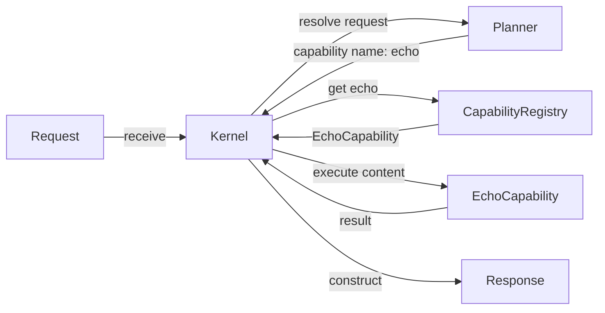

# Mapa de componentes actuales

> [!warning] Naturaleza derivada
> Este documento representa únicamente relaciones verificadas en el repositorio oficial para el baseline indicado.
>
> No redefine la arquitectura, no documenta capacidades futuras y no posee autoridad operativa.

## 1. Alcance

Este primer mapa cubre exclusivamente el flujo mínimo implementado entre:

- `Request`;
- `Kernel`;
- `Planner`;
- `CapabilityRegistry`;
- `EchoCapability`;
- `Response`.

Quedan fuera de alcance:

- CLI;
- subsistema conversacional;
- proveedores;
- runtimes LLM;
- métricas y telemetría;
- persistencia;
- seguridad futura;
- componentes propuestos en el roadmap.

Su exclusión de este documento no implica que no existan. Solamente evita mezclar subsistemas todavía no verificados dentro de este mapa.

## 2. Baseline representado

- **Repositorio:** `Aranwill/jarvis`
- **Rama:** `main`
- **Commit:** `fdb3ee922efc796e53ade1fc3abe4125f4072bd0`
- **Versión nominal:** `v0.6.0-alpha`
- **Último sprint cerrado:** Sprint 7.2 — Runtime Metric Sink Contract

## 3. Componentes verificados

### `Request`

Contrato de entrada recibido por el Kernel.

Fuente:

```text
src/malak/core/request.py
```

### `Kernel`

Punto de entrada del flujo gobernado mínimo.

Responsabilidades verificadas:

- crear el Planner;
- crear el Capability Registry;
- validar solicitudes vacías;
- solicitar al Planner una capability;
- recuperar la capability desde el registro;
- ejecutar la capability;
- construir la respuesta.

Fuente:

```text
src/malak/kernel/kernel.py
```

### `Planner`

Selector determinista de capability.

Comportamiento actual:

```text
Siempre resuelve la capability "echo".
```

Fuente:

```text
src/malak/services/planner.py
```

### `CapabilityRegistry`

Registro en memoria de capabilities disponibles.

Responsabilidades verificadas:

- registrar capabilities;
- impedir nombres duplicados;
- recuperar una capability por nombre;
- listar capabilities registradas;
- normalizar nombres a minúsculas.

Fuente:

```text
src/malak/kernel/registry.py
```

### `EchoCapability`

Capability registrada durante el bootstrap del Kernel.

Fuente:

```text
src/malak/capabilities/echo.py
```

### `Response`

Contrato de salida construido por el Kernel.

Fuente:

```text
src/malak/core/response.py
```

## 4. Flujo implementado



## 5. Secuencia funcional

1. El sistema entrega un `Request` al método `Kernel.receive`.
2. El Kernel rechaza el contenido vacío.
3. El Kernel solicita al Planner el nombre de la capability.
4. El Planner devuelve actualmente `"echo"`.
5. El Kernel consulta el `CapabilityRegistry`.
6. El registro devuelve `EchoCapability`.
7. El Kernel ejecuta la capability con el contenido de la solicitud.
8. El Kernel construye un `Response`.
9. La respuesta identifica como fuente a la capability ejecutada.

## 6. Bootstrap verificado

El registro predeterminado se crea mediante:

```text
src/malak/kernel/bootstrap.py
```

El comportamiento verificado es:

1. crear una instancia de `CapabilityRegistry`;
2. crear y registrar `EchoCapability`;
3. devolver el registro inicializado.

Actualmente este documento no afirma que existan otras capabilities registradas por defecto.

## 7. Límites de la representación

Este mapa no afirma:

- que el Planner utilice un LLM;
- que exista planificación dinámica;
- que el Kernel invoque directamente un runtime LLM;
- que el subsistema conversacional forme parte de este flujo;
- que existan múltiples capabilities activas;
- que el registro sea persistente;
- que el diagrama represente toda la arquitectura de Malāk.

## 8. Hallazgos arquitectónicos descriptivos

Sin convertirlos en decisiones nuevas, el código observado muestra:

- selección de capability separada de su ejecución;
- resolución determinista en el Planner actual;
- registro desacoplado mediante el contrato `Capability`;
- bootstrap explícito de capabilities;
- respuesta final construida por el Kernel;
- tratamiento explícito de solicitudes vacías y capabilities inexistentes.

## 9. Fuentes oficiales

- `src/malak/kernel/kernel.py`
- `src/malak/kernel/bootstrap.py`
- `src/malak/kernel/registry.py`
- `src/malak/services/planner.py`
- `src/malak/contracts/capability.py`
- `src/malak/capabilities/echo.py`
- `src/malak/core/request.py`
- `src/malak/core/response.py`

## 10. Navegación relacionada

- [[01-architecture/ARCHITECTURE_INDEX|Índice de arquitectura]]
- [[02-current-baseline/CURRENT_BASELINE|Baseline vigente]]
- [[08-session-context/MALAK_SESSION_CONTEXT|Contexto de sesión]]
- [[09-repository-snapshots/2026-07-20_MAIN_FDB3EE9|Snapshot del baseline]]
- [[10-knowledge-index/KNOWLEDGE_INDEX|Índice maestro]]

## 11. Próximos mapas posibles

Los siguientes mapas permanecen pendientes y no están aprobados automáticamente:

- mapa del subsistema conversacional;
- mapa de métricas y telemetría;
- mapa de contratos actuales;
- mapa de límites del Kernel.

Cada uno deberá verificarse separadamente contra el repositorio oficial.
